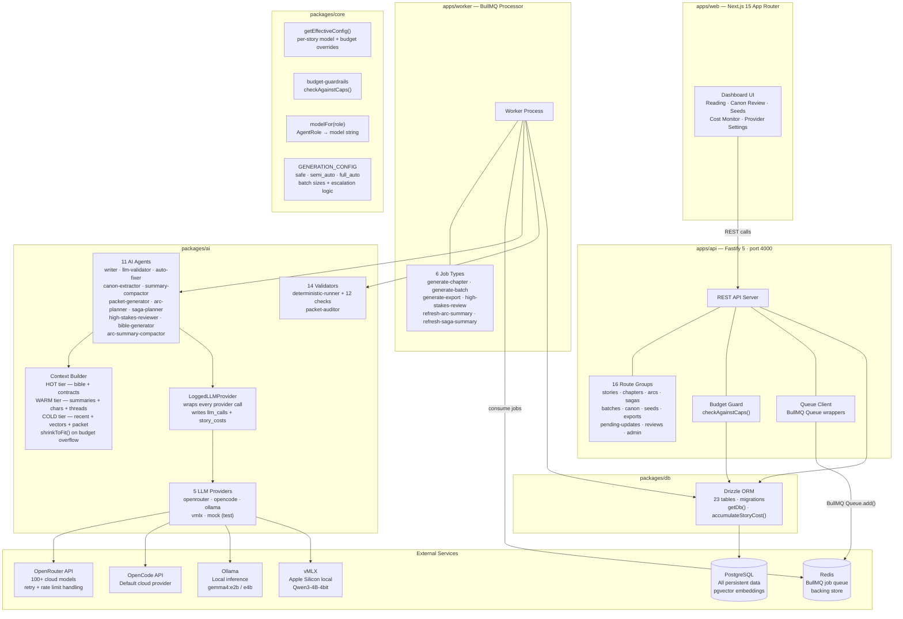

# Architecture: System Overview

Full system architecture of the Novel Writer monorepo — a single-user local application for generating long-form Vietnamese xianxia/fantasy novels (500–1000 chapters). Target cost ≤ $0.05/chapter using a "system remembers, model writes" design.

## Diagram

## Package / App Roles

| Package / App | Type | Responsibility |
|--------------|------|----------------|
| [[apps/app-api]] | Fastify 5 server (port 4000) | REST API; validates requests; checks budget; snapshots LLM provider; enqueues jobs |
| [[apps/app-web]] | Next.js 15 App Router | Dashboard: read chapters, review canon, manage seeds, monitor costs, configure providers |
| [[apps/app-worker]] | BullMQ processor | Background job runner — full chapter generation pipeline + all async follow-ups |
| [[packages/package-ai]] | Library | All LLM agents, provider abstraction, validators, context builder, prompts |
| [[packages/package-core]] | Library | Config, budget policy, model routing, generation mode logic, per-story effective config |
| [[packages/package-db]] | Library | Drizzle ORM schema, PostgreSQL client, migrations, cost tracker |

## Key Architectural Principles

### "System remembers, model writes"
The LLM never sees conversation history. [[modules/context-builder]] assembles everything the model needs from the DB each time, in a carefully budgeted 3-tier context (HOT/WARM/COLD). The model's only job is to write prose from what the system explicitly gives it.

### Provider abstraction with DB-driven routing
All LLM calls go through [[ai-providers/provider-interface]]. The active provider is snapshotted at job-enqueue time (not at write time). `modelFor(role)` resolves model names — **no hardcoded model strings** outside `MODEL_CONFIG`. See [[flows/llm-provider-flow]].

### Canon integrity via staging
New facts extracted from chapters are **never written directly to canon**. [[agents/canon-extractor]] → [[modules/canon-merger]] → conflict check → either auto-apply (clean, `auto` mode) or stage to `pending_canon_updates` for human approval. See [[errors/error-canon-conflict]].

### Two-stage validation
Stage 1: 12 deterministic checks (no LLM, fast, blocks on critical). Stage 2: LLM soft validation. Auto-fixer handles low/medium issues; high/critical escalate. See [[flows/validation-flow]].

### Budget guardrails at two enforcement points
1. Pre-enqueue (API): [[modules/budget-guard]] rejects request before job is queued
2. Mid-pipeline (Worker): `checkAgainstCaps()` fails the job if cap breached during generation
See [[errors/error-budget-exceeded]].

### Generation modes with auto-escalation
| Mode | Batch Size | Human Approval |
|------|-----------|----------------|
| `safe` | 1 | Required |
| `semi_auto` | 5 | On escalation |
| `full_auto` | 30 | On escalation |

Auto-escalates to `safe` on: first/last chapter of arc, high/critical finding, blocking canon conflict. See [[jobs/job-generate-batch]].

## Data Flow Summary

1. User triggers generation via [[apps/app-web]] → `POST /api/stories/:id/chapters/:num/generate`
2. [[apps/app-api]]: validates request → checks budget → reads active LLM provider from DB → snapshots into job payload → enqueues to Redis
3. [[apps/app-worker]]: picks up `generate-chapter` job → runs 13-stage pipeline (plan → write → validate → memory → summarize)
4. Each stage reads context from PostgreSQL; [[modules/context-builder]] assembles HOT/WARM/COLD tiers
5. LLM calls go through `LoggedLLMProvider` → every call written to `llm_calls`
6. Canon updates staged or applied; summary + embedding stored
7. Chapter status → `completed`; follow-up jobs enqueued (arc summary, high-stakes review)
8. [[apps/app-web]] polls chapter status → displays completed chapter to user

## Related

- [[database/database-erd]] — full table diagram
- [[flows/chapter-generation-flow]] — detailed pipeline
- [[flows/validation-flow]] — validation stages
- [[flows/llm-provider-flow]] — provider routing
- [[flows/job-worker-flow]] — queue lifecycle
