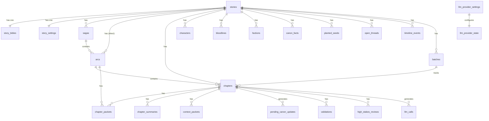

# Database ERD

Full entity-relationship diagram for all 23 tables across 5 domains. Managed by [[packages/package-db]] (Drizzle ORM). Primary store: [[external-services/service-postgresql]].

## Diagram

## Table Summaries

### Story Domain

| Table | Key Columns | Purpose |
|-------|------------|---------|
| [[database/tables/stories]] | `id`, `title`, `genre`, `status` | Root entity; all other tables belong to a story |
| [[database/tables/story-bibles]] | `storyId`, `content`, `styleGuide`, `powerSystem` | Narrative foundation; loaded into HOT tier context |
| [[database/tables/story-settings]] | `storyId`, `modelRoutes`, `budgetOverrides`, `contextWindowSizes` | Per-story config overrides — loaded via `getEffectiveConfig()` |
| [[database/tables/sagas]] | `storyId`, `number`, `title`, `rollingSummary` | Multi-arc story segments; rolling summary in WARM tier |
| [[database/tables/arcs]] | `storyId`, `sagaId`, `number`, `title`, `rollingSummary` | Narrative arcs within sagas; summary in WARM tier |
| [[database/tables/batches]] | `storyId`, `mode`, `status`, `completedChapters`, `pausedReason` | Tracks batch generation runs; holds mode (safe/semi_auto/full_auto) |

### Chapter Domain

| Table | Key Columns | Purpose |
|-------|------------|---------|
| [[database/tables/chapters]] | `storyId`, `arcId`, `number`, `title`, `content`, `status`, `wordCount`, `deterministicValidation` | Generated chapter prose + all metadata; central write target |
| [[database/tables/chapter-packets]] | `chapterId`, `arcId`, `packet` (JSON) | Planning packets (goals, beats, character intents) generated by [[agents/packet-generator]] |
| [[database/tables/chapter-summaries]] | `chapterId`, `summary`, `embedding` (vector 1536) | Compact summaries + embeddings for COLD tier past-chapter retrieval |
| [[database/tables/context-packets]] | `chapterId`, `hotTierHash`, `warmTierHash`, `contextSnapshot` | Full context snapshots for observability; written by [[modules/context-builder]] |

### Canon Domain

| Table | Key Columns | Purpose |
|-------|------------|---------|
| [[database/tables/characters]] | `storyId`, `name`, `realmLevel`, `status`, `attributes` (JSON) | Character roster; active characters loaded into WARM tier |
| [[database/tables/bloodlines]] | `storyId`, `name`, `description`, `abilities` | Cultivation bloodline lineages; used by check-new-bloodline-source validator |
| [[database/tables/factions]] | `storyId`, `name`, `description`, `allegiance` | Political/martial factions for world coherence |
| [[database/tables/canon-facts]] | `storyId`, `content`, `embedding` (vector 1536), `locked`, `source` | Established world facts; `locked = true` blocks any contradiction |
| [[database/tables/pending-canon-updates]] | `chapterId`, `type`, `proposedData`, `status`, `conflictDetails` | Updates staged by [[modules/canon-merger]] awaiting human approve/reject |
| [[database/tables/planted-seeds]] | `storyId`, `content`, `dueChapter`, `paidOff` | Narrative hooks (foreshadowing) to resolve in future chapters; loaded into COLD tier |
| [[database/tables/open-threads]] | `storyId`, `content`, `status` | Unresolved plot threads tracked across chapters; loaded into WARM tier |
| [[database/tables/timeline-events]] | `storyId`, `chapterId`, `event`, `happenedAt` | Ordered story event log for temporal consistency |

### Validation Domain

| Table | Key Columns | Purpose |
|-------|------------|---------|
| [[database/tables/validations]] | `chapterId`, `type` (deterministic/llm), `results` (JSON), `severity`, `pass` | All validation results from [[validators/deterministic-runner]] and [[agents/llm-validator]] |
| [[database/tables/high-stakes-reviews]] | `chapterId`, `triggerReason`, `findings`, `severity`, `approve`, `recommendedActions` | Async deep-review outputs from [[agents/high-stakes-reviewer]] |

### Observability Domain

| Table | Key Columns | Purpose |
|-------|------------|---------|
| [[database/tables/llm-calls]] | `storyId`, `chapterId`, `agentRole`, `model`, `inputTokens`, `outputTokens`, `costUsd`, `latencyMs`, `promptText?` | Per-call LLM usage log; primary source for budget enforcement |
| [[database/tables/llm-provider-settings]] | `providerName`, `modelRoutes` (JSON), `isActive`, `config` (JSON) | Stored provider configuration + model routing overrides |
| [[database/tables/llm-provider-state]] | `activeProvider`, `updatedAt` | Singleton row: the currently active provider name |

## Vector Columns

Two tables use `pgvector` for semantic retrieval:
- `chapter_summaries.embedding` — powers past-chapter retrieval in COLD tier (top 3 by similarity)
- `canon_facts.embedding` — powers fact retrieval in COLD tier (top 8 by similarity)

Both are generated by [[modules/embedding-service]] when records are inserted.

## Managed By

[[packages/package-db]] — schema in `packages/db/src/schema/`, migrations via `pnpm db:generate` + `pnpm db:migrate`

## Related

- [[architecture/system-architecture]]
- [[flows/chapter-generation-flow]]
- [[external-services/service-postgresql]]
