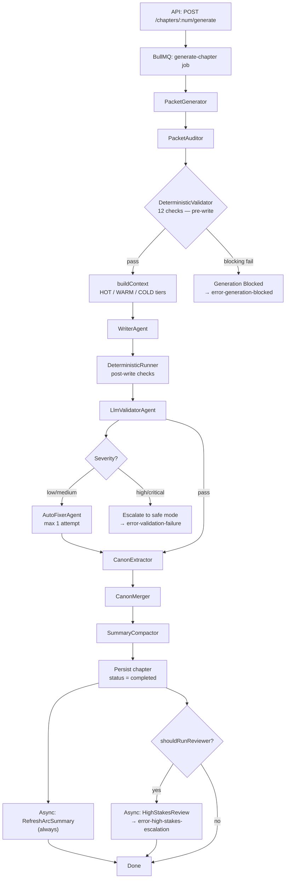

# Flow: Chapter Generation

**Type:** System Flow

## Overview

The main chapter production pipeline, orchestrated by [[jobs/job-generate-chapter]]. Transforms a chapter number + arc context into completed chapter prose stored in the database. Runs as a BullMQ background job (concurrency 1). Triggered by an API call or spawned by [[jobs/job-generate-batch]].

## Diagram

## Pipeline Stages

| # | Stage | Actor | DB Written |
|---|-------|-------|------------|
| 1 | Packet generation | [[agents/packet-generator]] | [[database/tables/chapter-packets]] |
| 2 | Canon audit (pre-write) | [[validators/packet-auditor]] | — (may retry packet gen once) |
| 3 | Deterministic pre-check | [[validators/deterministic-runner]] | [[database/tables/validations]] |
| 4 | Context assembly | [[modules/context-builder]] | [[database/tables/context-packets]] |
| 5 | Write prose | [[agents/writer]] | [[database/tables/chapters]] (draft) |
| 6 | Deterministic post-check | [[validators/deterministic-runner]] | [[database/tables/validations]] |
| 7 | LLM validation | [[agents/llm-validator]] | [[database/tables/validations]] |
| 8 | Auto-fix (conditional) | [[agents/auto-fixer]] | [[database/tables/chapters]] (revised) |
| 9 | Canon extraction | [[agents/canon-extractor]] | — |
| 10 | Canon merge | [[modules/canon-merger]] | [[database/tables/characters]], [[database/tables/canon-facts]], [[database/tables/open-threads]], [[database/tables/timeline-events]], [[database/tables/planted-seeds]], [[database/tables/pending-canon-updates]] |
| 11 | Summary compact | [[agents/summary-compactor]] | [[database/tables/chapter-summaries]] |
| 12 | Finalize chapter | job completes | [[database/tables/chapters]] (status = completed) |
| 13 | Async: arc summary refresh | [[jobs/job-refresh-arc-summary]] | [[database/tables/arcs]] |
| 14 | Async: high-stakes review (conditional) | [[jobs/job-high-stakes-review]] | [[database/tables/high-stakes-reviews]] |

## Participants

- [[jobs/job-generate-chapter]] — orchestrator
- [[agents/packet-generator]], [[validators/packet-auditor]] — plan stage
- [[validators/deterministic-runner]] — deterministic checks (pre and post write)
- [[modules/context-builder]] — 3-tier context assembly
- [[agents/writer]] — prose generation
- [[agents/llm-validator]], [[agents/auto-fixer]] — LLM validation + fix
- [[agents/canon-extractor]], [[modules/canon-merger]] — memory stage
- [[agents/summary-compactor]] — summary + embedding
- [[jobs/job-refresh-arc-summary]], [[jobs/job-high-stakes-review]] — async follow-ups

## Triggers

- API call: `POST /api/stories/:storyId/chapters/:num/generate` → [[routes/chapters]]
- Batch coordinator: [[jobs/job-generate-batch]] spawns one `generate-chapter` job per chapter

## Outputs / Side Effects

- [[database/tables/chapters]] — title, content, status, wordCount, deterministicValidation
- [[database/tables/chapter-packets]] — generated planning packet
- [[database/tables/context-packets]] — context snapshot + tier hashes (observability)
- [[database/tables/validations]] — all validation results
- [[database/tables/chapter-summaries]] — compacted summary + 1536-dim embedding
- [[database/tables/characters]], [[database/tables/canon-facts]], [[database/tables/open-threads]], [[database/tables/planted-seeds]], [[database/tables/timeline-events]] — updated via canon merger
- [[database/tables/pending-canon-updates]] — conflicting updates staged for human review
- [[database/tables/llm-calls]] — every LLM call logged with tokens + cost

## Error Paths

- Deterministic blocking → [[errors/error-generation-blocked]]
- LLM validation high/critical → [[errors/error-validation-failure]]
- Budget cap breached → [[errors/error-budget-exceeded]]
- Canon conflict detected → [[errors/error-canon-conflict]]
- High-stakes trigger (async) → [[errors/error-high-stakes-escalation]]

## Generation Modes

| Mode | Batch Size | Human Approval Needed |
|------|------------|-----------------------|
| `safe` | 1 chapter | Required before each chapter |
| `semi_auto` | 5 chapters | On escalation only |
| `full_auto` | 30 chapters | On escalation only |

Auto-escalation to `safe` is triggered when: first/last chapter of an arc, high/critical validator finding, or blocking canon conflict.

## Related Flows

- [[flows/validation-flow]]
- [[flows/llm-provider-flow]]
- [[flows/job-worker-flow]]
