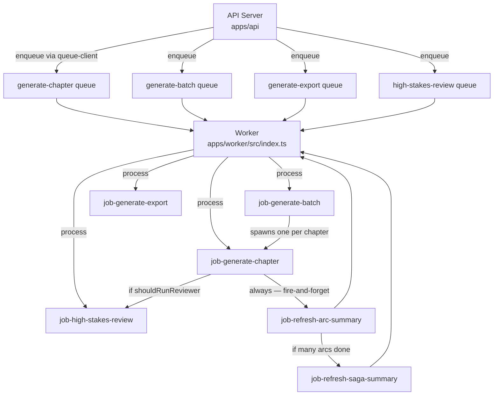

# Flow: Job / Worker

**Type:** System Flow

## Overview

How background work is enqueued by the API and processed by the BullMQ worker. The API is the sole producer; the worker is the sole consumer. Jobs are durable (Redis-backed) and survive process restarts. The LLM provider configuration is snapshotted into the job payload at enqueue time, ensuring the worker uses the exact provider active when the job was requested.

## Diagram

## Queues

| Queue | Producer | Consumer | Concurrency |
|-------|---------|---------|-------------|
| `generate-chapter` | [[modules/queue-client]] / [[jobs/job-generate-batch]] | [[jobs/job-generate-chapter]] | 1 |
| `generate-batch` | [[modules/queue-client]] | [[jobs/job-generate-batch]] | 1 |
| `generate-export` | [[modules/queue-client]] | [[jobs/job-generate-export]] | 2 |
| `high-stakes-review` | [[modules/queue-client]] / [[jobs/job-generate-chapter]] | [[jobs/job-high-stakes-review]] | 1 |
| `refresh-arc-summary` | [[jobs/job-generate-chapter]] | [[jobs/job-refresh-arc-summary]] | 1 |
| `refresh-saga-summary` | [[jobs/job-refresh-arc-summary]] | [[jobs/job-refresh-saga-summary]] | 1 |

## Job Lifecycle

1. API handler validates request + checks budget via [[modules/budget-guard]]
2. API reads active LLM provider from [[database/tables/llm-provider-state]] → snapshots `providerName` + `modelRoutes` into job payload
3. Job enqueued to Redis via [[modules/queue-client]] (BullMQ `Queue.add()`)
4. [[workers/worker-main]] picks up job from the appropriate queue
5. Job handler runs its full pipeline
6. On success: chapter status → `completed`; follow-up jobs enqueued (fire-and-forget)
7. On failure: chapter status → `failed`; error stored in BullMQ job result
8. Stale job detector (polls every 5 min) resets any chapter stuck in `generating` status back to `failed`

## Participants

- [[apps/app-api]] — sole job producer
- [[apps/app-worker]] — sole job consumer
- [[workers/worker-main]] — bootstraps all 6 BullMQ Worker instances + stale detector
- [[workers/queues]] — TypeScript Queue instances + job type declarations
- [[modules/queue-client]] — API-side enqueue wrappers
- [[external-services/service-redis]] — Redis backing store
- [[external-services/service-bullmq]] — BullMQ queue framework

## Triggers

- `POST /api/stories/:storyId/chapters/:num/generate` → enqueues `generate-chapter`
- `POST /api/stories/:storyId/batches` → enqueues `generate-batch`
- `POST /api/stories/:storyId/export` → enqueues `generate-export`
- `POST /api/stories/:storyId/chapters/:num/review` → enqueues `high-stakes-review`

## Outputs / Side Effects

- Job status tracked in Redis (BullMQ-managed: waiting → active → completed/failed)
- Chapter status transitions: `pending` → `generating` → `completed` / `failed`
- All DB writes happen inside individual job handlers (see each job note)
- Stale job detector resets chapters stuck > lock duration in `generating` → `failed`

## Error Paths

- Job throws unhandled error → BullMQ marks job `failed`; worker logs error
- Stale detection: chapter stuck in `generating` with no active BullMQ job → reset to `failed`
- Budget exceeded before enqueue → HTTP error returned to API caller; job never enqueued

## Related Flows

- [[flows/chapter-generation-flow]]
- [[flows/llm-provider-flow]]
