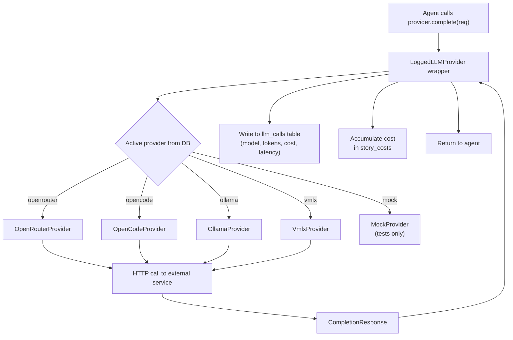

# Flow: LLM Provider

**Type:** System Flow

## Overview

How every LLM completion request is routed from an agent through the provider abstraction layer, logged, and costed. The active provider is snapshotted at job-enqueue time; the worker instantiates the correct provider class and wraps it in `LoggedLLMProvider` before passing it to any agent.

## Diagram

## Provider Selection

1. **At job-enqueue time** (API): reads `llm_provider_settings` + `llm_provider_state` from DB → snapshots `providerName` + `modelRoutes` into the BullMQ job payload
2. **At job execution** (Worker): instantiates the correct provider class from `providerName` in the job data
3. Provider is wrapped by `LoggedLLMProvider` before being passed to any agent — no agent ever touches an unwrapped provider

| Provider Name | External Service | Auth Env Var | Retry |
|--------------|-----------------|--------------|-------|
| `openrouter` | [[external-services/service-openrouter]] | `OPENROUTER_API_KEY` | 6 attempts, exp. backoff |
| `opencode` | [[external-services/service-opencode]] | `OPENCODE_API_KEY` | None (single attempt) |
| `ollama` | [[external-services/service-ollama]] | None (local) | None |
| `vmlx` | [[external-services/service-vmlx]] | None (local) | None |
| `mock` | N/A | None | N/A — tests only |

## Model Routing

- `modelFor(role: AgentRole)` from `@novel/core` reads `MODEL_CONFIG.routes` to map agent role → model string
- Active DB settings override defaults at runtime via `PUT /api/admin/models` (→ [[routes/admin]])
- Per-story overrides via `story_settings`, loaded with `getEffectiveConfig(storyId, provider)` — always used inside worker jobs
- **Never hardcode model strings** — using a literal model name outside `MODEL_CONFIG` is a bug

## Cost Calculation

- `estimateCostUsd(model, usage)` from `MODEL_CONFIG.pricing` (per-token pricing table)
- Per-chapter hard cap: **$0.05** | Daily: **$5.00** | Monthly: **$50.00**
- Budget checked pre-enqueue ([[modules/budget-guard]]) and during generation (`checkAgainstCaps()`)
- See [[errors/error-budget-exceeded]]

## Participants

- All AI agents: [[agents/writer]], [[agents/llm-validator]], [[agents/auto-fixer]], [[agents/canon-extractor]], [[agents/summary-compactor]], [[agents/packet-generator]], [[agents/arc-planner]], [[agents/saga-planner]], [[agents/high-stakes-reviewer]], [[agents/bible-generator]], [[agents/arc-summary-compactor]]
- [[ai-providers/provider-interface]] — shared contract
- [[ai-providers/provider-openrouter]], [[ai-providers/provider-opencode]], [[ai-providers/provider-ollama]], [[ai-providers/provider-vmlx]], [[ai-providers/provider-mock]]
- [[modules/llm-call-logger]] — inside `LoggedLLMProvider`
- [[modules/cost-tracker]] — `accumulateStoryCost()`

## Triggers

- Any agent calls `provider.complete(req)` during pipeline execution

## Outputs / Side Effects

- [[database/tables/llm-calls]] — every call: model, prompt tokens, completion tokens, cost (USD), latency (ms), optionally full prompt text (`LOG_LLM_PROMPTS` env var)
- Rolling cost accumulator updated in `story_costs` (via [[modules/cost-tracker]])
- Budget guardrails enforced on each call

## Error Paths

- Budget cap breached → [[errors/error-budget-exceeded]]
- Provider HTTP error (non-retryable) → exception thrown to agent; job marked `failed`
- Rate limit (`openrouter` only) → exponential backoff, up to 6 retries before failing

## Related Flows

- [[flows/chapter-generation-flow]]
- [[flows/job-worker-flow]]
