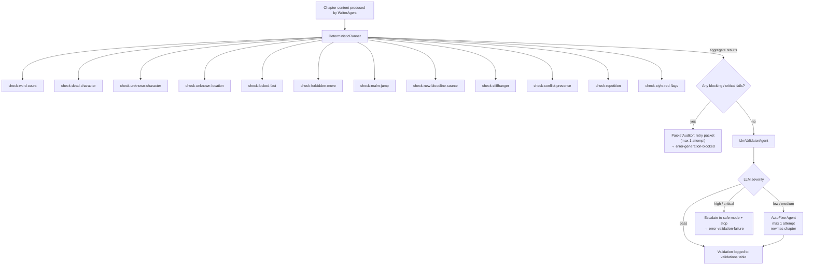

# Flow: Validation

**Type:** System Flow

## Overview

Two-stage validation pipeline that checks generated chapter content for canon integrity and narrative quality. Stage 1 is deterministic (no LLM, fast, 12 checks). Stage 2 uses an LLM. [[agents/auto-fixer]] handles low/medium issues automatically; high/critical findings halt generation and escalate to safe mode.

## Diagram

## Stage 1 — Deterministic (12 Checks)

All checks run in one pass; sorted critical-first; short-circuits on first `critical` failure.

| Check | Severity | Condition |
|-------|----------|-----------|
| [[validators/check-word-count]] | high | Content too short |
| [[validators/check-dead-character]] | critical | Dead char referenced alive |
| [[validators/check-realm-jump]] | critical | Cultivation realm skipped (cultivation/martial only) |
| [[validators/check-locked-fact]] | high | Locked canon fact contradicted |
| [[validators/check-forbidden-move]] | high | Forbidden plot move used |
| [[validators/check-unknown-character]] | medium | Unknown character referenced |
| [[validators/check-unknown-location]] | medium | Unknown location referenced |
| [[validators/check-new-bloodline-source]] | medium | New bloodline introduced (cultivation only) |
| [[validators/check-cliffhanger]] | low | Chapter ends without hook |
| [[validators/check-conflict-presence]] | low | No meaningful conflict in chapter |
| [[validators/check-style-red-flags]] | medium | Style rule violations from bible |
| [[validators/check-repetition]] | low | Excessive repetition detected |

Runner: [[validators/deterministic-runner]] — `buildChecks()` + `runDeterministicValidator()`

## Stage 2 — LLM Validation

[[agents/llm-validator]] evaluates style consistency, narrative voice, and logic coherence.  
Output: `{ pass, issues: [{code, severity, message}], summary }`  
Temperature: 0.1

## Stage 3 — Auto-Fix (Conditional)

[[agents/auto-fixer]] runs when max severity ≤ `medium`.  
- Max 1 attempt (`AUTO_FIX_MAX_ATTEMPTS = 1`)  
- Rewrites chapter content addressing all listed issues  
- On success: generation continues to canon extraction  
- `high`/`critical`: auto-fixer does NOT run; generation escalates

## Participants

- [[validators/deterministic-runner]]
- [[validators/check-word-count]], [[validators/check-dead-character]], [[validators/check-unknown-character]], [[validators/check-unknown-location]], [[validators/check-locked-fact]], [[validators/check-forbidden-move]], [[validators/check-realm-jump]], [[validators/check-new-bloodline-source]], [[validators/check-cliffhanger]], [[validators/check-conflict-presence]], [[validators/check-repetition]], [[validators/check-style-red-flags]]
- [[agents/llm-validator]]
- [[agents/auto-fixer]]
- [[validators/packet-auditor]] (pre-write blocking check)

## Triggers

- Called after [[agents/writer]] produces chapter content (post-write)
- [[validators/packet-auditor]] also runs deterministic checks pre-write on the planning packet
- Both are part of [[flows/chapter-generation-flow]]

## Outputs / Side Effects

- [[database/tables/validations]] — all `CheckResult` records persisted (both deterministic + LLM)
- [[database/tables/chapters]] — `deterministicValidation` JSON field updated; content may be replaced by auto-fixer

## Error Paths

- Critical deterministic failure → [[errors/error-generation-blocked]]
- LLM high/critical finding → [[errors/error-validation-failure]]

## Related Flows

- [[flows/chapter-generation-flow]]
- [[flows/llm-provider-flow]]
## Fix (2026-05-06)
The deterministic runner now runs **8 checks** (not 12). The following were retired from the runner and migrated to `llm-validator.v2.ts`:
- `cliffhanger` (low)
- `conflict-presence` (low)
- `style-red-flags` (medium)
- `repetition` (low)

Current `buildChecks()` order:
1. `dead-character-check` (critical)
2. `realm-jump-check` (critical, cultivation only)
3. `new-bloodline-source-check` (medium, cultivation only)
4. `locked-fact-check` (high)
5. `forbidden-move-check` (high)
6. `word-count-check` (high)
7. `unknown-character-check` (medium)
8. `unknown-location-check` (medium)
9. `unknown-faction-check` (medium)
## Fix (2026-05-06)
Validation flow check table is now stale — only 9 checks in the deterministic runner (4 retired to LLM validator). Updated table: dead-character (critical), realm-jump (critical, cultivation only), new-bloodline-source (medium, cultivation only), locked-fact (critical), forbidden-move (high), word-count (high), unknown-character (medium), unknown-location (medium), unknown-faction (medium). Cliffhanger, conflict-presence, style-red-flags, repetition removed from runner.
## Correction (2026-05-06) — Mermaid Diagram Still Shows 12 Checks
The mermaid diagram lists C1-C12 with all 12 check names including the 4 retired ones (cliffhanger, conflict-presence, style-red-flags, repetition). The corrected set is 9 checks in this order: dead-character, realm-jump, new-bloodline-source, locked-fact, forbidden-move, word-count, unknown-character, unknown-location, unknown-faction. Diagram needs redrawing to reflect 9-node version.

## Correction (2026-05-06) — Table Severity Stale
The Stage 1 table still shows `locked-fact` as high and `unknown-faction` as missing. Correct severities: locked-fact=critical, unknown-faction=low. Unknown-faction was added post-Phase 1 and is NOT cultivation-specific.