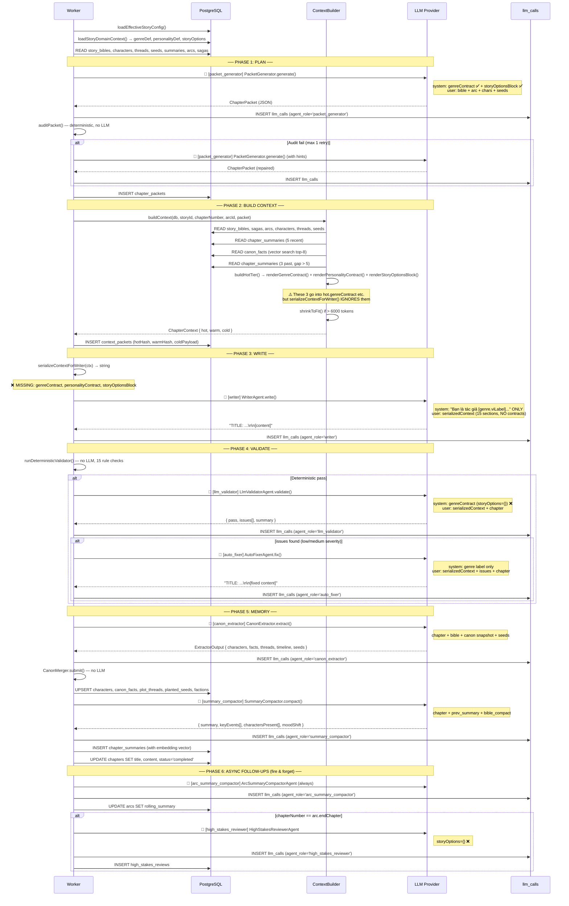

# Báo cáo Kỹ thuật: Phân tích LLM Calls & Context Injection

> **Ngày tạo:** Scan toàn bộ codebase  
> **Phạm vi:** `packages/ai`, `packages/core`, `packages/db`, `apps/worker`, `apps/api`, `apps/web`  
> **Mục tiêu:** Tìm nguyên nhân gốc rễ khiến output không bám sát story options / genre settings

---

## 1. Executive Summary

Hệ thống có **11 LLM agents** với tổng cộng **12–13 LLM calls** mỗi chapter (PacketGenerator có thể gọi 2 lần). Infrastructure logging đầy đủ (mọi call đều ghi vào `llm_calls`). Tuy nhiên, tồn tại **4 lỗ hổng nghiêm trọng** trong context injection:

| # | Lỗ hổng | Mức độ | Agent bị ảnh hưởng |
|---|---------|--------|--------------------|
| **L1** | `serializeContextForWriter()` không inject `genreContract`, `personalityContract`, `storyOptionsBlock` vào Writer | 🔴 **CRITICAL** | `WriterAgent`, `AutoFixerAgent` |
| **L2** | `renderGenreContract()` nhận `storyOptions` nhưng **hoàn toàn bỏ qua** (`_opts` unused) | 🔴 **CRITICAL** | Tất cả agent dùng genre contract |
| **L3** | `LlmValidatorAgent` và `HighStakesReviewerAgent` truyền `{}` thay vì `storyOptions` thực | 🟠 **HIGH** | `LlmValidatorAgent`, `HighStakesReviewerAgent` |
| **L4** | Hard-code cultivation terms (`đột phá`, `cảnh giới`) trong prompts dùng cho **mọi genre** | 🟡 **MEDIUM** | `LlmValidator`, `SummaryCompactor`, `ArcSummaryCompactor` |

**Kết luận nhanh:**  
`story-options.ts` xuất 10 options đều được lưu vào DB và load bởi worker — nhưng **không một option nào** đến được prompt của `WriterAgent` (agent quan trọng nhất). Hậu quả: dù người dùng chọn POV, pacing, tone, morality, romance level khác nhau, writer LLM không hề biết và sẽ fall back về phong cách mặc định trong training data của model.

---

## 2. Tổng số LLM Calls

| Tổng | Chi tiết |
|------|---------|
| **11 agents** | 9 agent per-chapter/pipeline + 2 async agents |
| **12–13 calls/chapter** | PacketGenerator gọi 2 lần nếu audit fail |
| **5 providers** | `opencode`, `openrouter`, `ollama`, `vmlx`, `mock` |
| **100% logged** | Mọi call đều qua `LoggedLLMProvider` → `llm_calls` table |

---

## 3. Bảng Inventory Toàn Bộ LLM Calls

| # | File | Agent / Function | Role key | Mục đích | Temp | Input context | System prompt builder | Output | Logged? |
|---|------|-----------------|----------|----------|------|--------------|----------------------|--------|---------|
| 1 | `agents/packet-generator.ts` | `PacketGenerator.generate()` | `packet_generator` | Lập kế hoạch chương (ChapterPacket) | 0.4 | bible, arc, chars, threads, seeds, pacing hints | `packetGeneratorPromptV2` — có `genreContract` + `storyOptionsBlock` | JSON `ChapterPacket` | ✅ |
| 2 | `agents/packet-generator.ts` | `PacketGenerator.generate()` (repair) | `packet_generator` | Sửa JSON lỗi sau parse fail | 0.2 | broken JSON + repair instructions | Hard-coded: `"Bạn là bộ sửa JSON ChapterPacket."` | JSON `ChapterPacket` | ✅ |
| 3 | `agents/writer.ts` | `WriterAgent.write()` | `writer` | Viết nội dung chương (~2000-3000 từ) | 0.85 | `serializedContext` (15 sections) | `writerPromptV2` — chỉ có `genreDef.viLabel` | Free text `title + content` | ✅ |
| 4 | `agents/llm-validator.ts` | `LlmValidatorAgent.validate()` | `llm_validator` | Validate chất lượng chapter | 0.1 | `serializedContext` + chapter content | `llmValidatorPromptV2` — có `genreContract` nhưng truyền `{}` | JSON `{ pass, issues[], summary }` | ✅ |
| 5 | `agents/auto-fixer.ts` | `AutoFixerAgent.fix()` | `auto_fixer` | Sửa issues từ validator | 0.85 | `serializedContext` + issue list + chapter | `autoFixerPromptV2` | Free text `title + content` | ✅ |
| 6 | `agents/canon-extractor.ts` | `CanonExtractor.extract()` | `canon_extractor` | Trích xuất canon facts từ chapter | 0.2 | chapter + bible + canon snapshot + seeds | `canonExtractorPromptV2` | JSON `ExtractorOutput` | ✅ |
| 7 | `agents/summary-compactor.ts` | `SummaryCompactor.compact()` | `summary_compactor` | Tóm tắt chapter | 0.2 | chapter + prev summary + bible | `summaryCompactorPromptV2` | JSON `SummaryCompactorOutput` | ✅ |
| 8 | `agents/high-stakes-reviewer.ts` | `HighStakesReviewerAgent.review()` | `high_stakes_reviewer` | Review arc-end chapters | 0.3 | bible + arc summary + chapter | `highStakesReviewerPromptV2` — có `genreContract` nhưng truyền `{}` | JSON `HighStakesReview` | ✅ |
| 9 | `agents/arc-summary-compactor.ts` | `ArcSummaryCompactorAgent.compact()` | `arc_summary_compactor` | Tóm tắt toàn arc | 0.4 | arc title + per-chapter summaries | `arcSummaryCompactorPromptV2` | Plain text | ✅ |
| 10 | `agents/arc-planner.ts` | `ArcPlannerAgent.plan()` | `arc_planner` | Lập kế hoạch cấu trúc arc | 0.7 | saga meta + turning points + seeds | `arcPlannerPromptV2` — có `genreContract` + `storyOptionsBlock` | JSON `ArcPlannerOutput` | ✅ |
| 11 | `agents/saga-planner.ts` | `SagaPlannerAgent.plan()` | `saga_planner` | Kiến trúc toàn bộ saga | 0.7 | bible + target chapters | `sagaPlannerPromptV2` — có `genreContract` + `storyOptionsBlock` | JSON `SagaPlannerOutput` | ✅ |
| 12 | `agents/bible-generator.ts` | `generateBible()` | (explicit) | Tạo story bible | 0.7 | premise + genre + options | `bibleGeneratorPromptV2` — có `storyOptionsBlock` | JSON `BibleV2` | ✅ |

> **Ghi chú:** Agent không gọi LLM: `CanonMerger` (pure logic), `PacketAuditor` (deterministic), `DeterministicValidator` (rule-based, 15 checks).

---

## 4. Mermaid Flowchart Tổng Quan

```mermaid
flowchart TD
    UI["🖥️ Web UI\n(story options, genre, personality)"]
    API["🔌 Fastify API\n/api/stories POST/PATCH"]
    DB_SETTINGS["📦 story_settings\n.overrides.storyOptions"]
    DB_STORIES["📦 stories\n.genre, .tone (orphan!)"]

    WORKER["⚙️ Worker\nBullMQ Job"]
    DOMAIN["loadStoryDomainContext()\ngenreDef + personalityDef\n+ storyOptions"]

    PACKET_GEN["🤖 LLM #1\nPacketGenerator\ngenreContract ✅\nstoryOptionsBlock ✅\npersonalityContract ✅"]
    AUDIT["🔍 PacketAuditor\n(deterministic, no LLM)"]
    DB_PACKET["📦 chapter_packets"]

    BUILD_CTX["buildContext()\nHOT + WARM + COLD"]
    HOT["HOT tier\n✅ systemRules\n✅ bibleCompact\n✅ styleGuide\n✅ powerSystem\n✅ genreContract (computed)\n✅ personalityContract (computed)\n✅ storyOptionsBlock (computed)"]
    WARM["WARM tier\n✅ sagaSummary\n✅ arcSummary\n✅ activeCharacters\n✅ arcOpenThreads\n✅ arcPlantedSeeds\n❌ knownFactions (not injected)"]
    COLD["COLD tier\n✅ recentSummaries\n✅ retrievedFacts\n✅ seedsToPlantNow\n✅ packet"]

    SERIALIZE["serializeContextForWriter()\n✅ systemRules, bibleCompact, styleGuide\n✅ powerSystem, styleFewShots\n✅ sagaSummary, arcSummary\n✅ activeCharacters, threads, seeds\n✅ recentSummaries, canonFacts, packet\n❌ genreContract MISSING\n❌ personalityContract MISSING\n❌ storyOptionsBlock MISSING"]

    WRITER["🤖 LLM #3\nWriterAgent\nsystem: genre label ONLY\nuser: serializedContext"]
    DET_VAL["🔍 DeterministicValidator\n(no LLM, 15 checks)"]
    LLM_VAL["🤖 LLM #4\nLlmValidatorAgent\ngenreContract ✅\nstoryOptions = {} ❌"]
    AUTOFIXER["🤖 LLM #5\nAutoFixerAgent\n(conditional on issues)"]
    CANON_EXT["🤖 LLM #6\nCanonExtractor"]
    CANON_MERGE["🔗 CanonMerger\n(no LLM)"]
    SUMMARY["🤖 LLM #7\nSummaryCompactor"]

    DB_CHAPTER["📦 chapters\n.content, .title, .status"]

    ASYNC1["⏳ Async: ArcSummaryCompactor\n🤖 LLM #9"]
    ASYNC2["⏳ Async: HighStakesReviewer\n🤖 LLM #8\nstoryOptions = {} ❌"]

    UI --> API
    API --> DB_SETTINGS
    API --> DB_STORIES
    DB_SETTINGS --> WORKER
    WORKER --> DOMAIN
    DOMAIN --> PACKET_GEN
    PACKET_GEN --> AUDIT
    AUDIT --> DB_PACKET
    DB_PACKET --> BUILD_CTX
    BUILD_CTX --> HOT
    BUILD_CTX --> WARM
    BUILD_CTX --> COLD
    HOT --> SERIALIZE
    WARM --> SERIALIZE
    COLD --> SERIALIZE
    SERIALIZE --> WRITER

    style SERIALIZE fill:#ff9999,stroke:#cc0000,color:#000
    style WRITER fill:#ffcccc,stroke:#cc0000,color:#000
    style LLM_VAL fill:#ffe0b2,stroke:#e65100,color:#000
    style ASYNC2 fill:#ffe0b2,stroke:#e65100,color:#000

    WRITER --> DET_VAL
    DET_VAL --> LLM_VAL
    LLM_VAL --> AUTOFIXER
    AUTOFIXER --> CANON_EXT
    CANON_EXT --> CANON_MERGE
    CANON_MERGE --> SUMMARY
    SUMMARY --> DB_CHAPTER
    DB_CHAPTER --> ASYNC1
    DB_CHAPTER --> ASYNC2
```



> 🔴 = Critical gap | 🟠 = storyOptions không được truyền đúng

---

## 5. Mermaid Sequence Diagram — Generate Chapter



---

## 6. Bảng Prompt Structure Từng LLM Call

| LLM Call | System prompt gồm gì | User prompt gồm gì | JSON schema? | Context blocks được inject | Context nào THIẾU |
|----------|---------------------|-------------------|--------------|--------------------------|-------------------|
| **PacketGenerator** | `genreContract` ✅ + `personalityContract` ✅ + `storyOptionsBlock` ✅ + role description | bible, arc, chars, threads, seeds, arc goals, forbidden rules | ✅ `ChapterPacket` schema | Đầy đủ nhất trong system | Validation errors history |
| **PacketGenerator (repair)** | Hard-coded: `"Bộ sửa JSON. Chỉ trả JSON."` | Broken JSON + fix instructions | ✅ | Không có context | Mọi thứ |
| **WriterAgent** | `"Bạn là tác giả [viLabel]."` + format rules | 15 sections: systemRules, bibleCompact, styleGuide, powerSystem, styleFewShots, sagaSummary, arcSummary, chars, threads, seeds, recentSummaries, canonFacts, pastChapters, seedsDue, packet | ❌ free text | 15 blocks tốt | **genreContract ❌, personalityContract ❌, storyOptionsBlock ❌** |
| **LlmValidatorAgent** | role description + `renderGenreContract(genreDef, {})` ⚠️ + `renderPersonalityContract(personalityDef)` ✅ + 7 criteria | `--- CANON CONTEXT ---\n{serializedContext}` + `--- CHAPTER CONTENT ---\n{chapterContent}` | ✅ `{ pass, issues[], summary }` | Tương đối đầy đủ | `storyOptionsBlock` ❌, storyOptions thực ❌ |
| **AutoFixerAgent** | genre label only + fix role + format rules | `serializedContext` + issues + original content | ❌ free text | 15 blocks | **genreContract ❌, personalityContract ❌, storyOptionsBlock ❌** |
| **CanonExtractor** | extraction rules + realm regression logic (hardcoded) | chapter + bible compact + canon snapshot + seeds + prev summary | ✅ `ExtractorOutput` | Khá đầy đủ | `storyOptions` context |
| **SummaryCompactor** | summary rules + `đột phá` hardcoded ⚠️ | chapter + prev summary + bible compact | ✅ `SummaryCompactorOutput` | Đủ | `storyOptions` context |
| **HighStakesReviewer** | role + `renderGenreContract(genreDef, {})` ⚠️ + `renderPersonalityContract` ✅ | bible compact + arc summary + chapter | ✅ `HighStakesReview` | Thiếu story options | `storyOptionsBlock` ❌ |
| **ArcSummaryCompactor** | compactor role + `đột phá` hardcoded ⚠️ | arc title + per-chapter summaries joined | ❌ plain text | Per-chapter summaries | Không có genre context |
| **ArcPlannerAgent** | `genreContract` ✅ + `storyOptionsBlock` ✅ + arc count rules | saga meta + turning points + current state + seeds | ✅ `ArcPlannerOutput` | Đầy đủ | Không có per-chapter history |
| **SagaPlannerAgent** | `genreContract` ✅ + `storyOptionsBlock` ✅ + saga count rules | bible compact + JSON schema hint | ❌ (JSON trong user msg) | Đầy đủ cho planning | Chapter-level details (không cần) |
| **BibleGenerator** | ❌ KHÔNG có system prompt | Full monolithic prompt: genre + personality + storyOptions + premise + per-field instructions | ✅ `BibleV2` | Đầy đủ nhất | N/A (initial generation) |

---

## 7. Trace `story-options.ts`

### 7.1 Các Options Được Export

File `packages/core/src/catalog/story-options.ts` export 10 arrays `as const`:

| Export | Slugs | Ý nghĩa |
|--------|-------|---------|
| `TONES` | `serious, humorous, dark, tragic, soft` | Giọng điệu |
| `PACINGS` | `slow, medium, fast, climax_heavy` | Nhịp độ |
| `MAIN_CONFLICT_TYPES` | `revenge, survival, power_struggle, mystery, growth` | Loại xung đột chính |
| `POWER_SYSTEM_STYLES` | `realm, level, skill, ability, martial, tech` | Phong cách hệ thống sức mạnh |
| `WORLD_ERAS` | `ancient, modern, future, otherworld, post_apocalypse` | Bối cảnh thời đại |
| `ROMANCE_LEVELS` | `none, light, medium, heavy` | Mức độ romance |
| `COMEDY_LEVELS` | `none, light, medium, heavy` | Mức độ hài hước |
| `DARK_LEVELS` | `bright, neutral, dark, extreme_dark` | Mức độ tăm tối |
| `POVS` | `third_limited, third_omniscient, first` | Góc nhìn trần thuật |
| `MORALITIES` | `righteous, pragmatic, antihero, villain` | Đạo đức nhân vật chính |

### 7.2 Bảng Trạng Thái Từng Option

| Option | Defined in `story-options.ts` | Used in UI | Saved to DB | Loaded by Worker | Injected to Planner prompts | Injected to Writer prompt | Status |
|--------|------------------------------|------------|-------------|------------------|-----------------------------|--------------------------|--------|
| `tone` | ✅ | ✅ | ✅ `story_settings.overrides.storyOptions.tone` | ✅ `loadStoryDomainContext()` | ✅ `packet_generator`, `saga_planner`, `arc_planner` | ❌ **MISSING** | **Saved but not injected to Writer** |
| `pacing` | ✅ | ✅ | ✅ | ✅ | ✅ | ❌ **MISSING** | **Saved but not injected to Writer** |
| `mainConflictType` | ✅ | ✅ | ✅ | ✅ | ✅ | ❌ **MISSING** | **Saved but not injected to Writer** |
| `powerSystemStyle` | ✅ | ✅ | ✅ | ✅ | ✅ | ❌ **MISSING** | **Saved but not injected to Writer** |
| `worldEra` | ✅ | ✅ | ✅ | ✅ | ✅ | ❌ **MISSING** | **Saved but not injected to Writer** |
| `romanceLevel` | ✅ | ✅ | ✅ | ✅ | ✅ | ❌ **MISSING** | **Saved but not injected to Writer** |
| `comedyLevel` | ✅ | ✅ | ✅ | ✅ | ✅ | ❌ **MISSING** | **Saved but not injected to Writer** |
| `darkLevel` | ✅ | ✅ | ✅ | ✅ | ✅ | ❌ **MISSING** | **Saved but not injected to Writer** |
| `pov` | ✅ | ✅ | ✅ | ✅ | ✅ | ❌ **MISSING** | **Saved but not injected to Writer** |
| `protagonistMorality` | ✅ | ✅ | ✅ | ✅ | ✅ | ❌ **MISSING** | **Saved but not injected to Writer** |

> ⚠️ **Bonus orphan:** `stories.tone` (bare column trên bảng `stories`) được lưu bởi API nhưng **không bao giờ được đọc** bởi worker hay bất kỳ agent nào. `loadStoryDomainContext()` chỉ đọc từ `story_settings.overrides.storyOptions.tone`. Đây là dead column.

### 7.3 Chi Tiết Đứt Gãy

Chain của `storyOptions` đứt tại **hai điểm độc lập**:

**Điểm đứt 1 — `renderGenreContract()` bỏ qua `storyOptions`:**
```packages/ai/src/prompts/contracts/genre-contract.ts#L3
export function renderGenreContract(g: GenreDef, _opts: StoryOptions): string {
  // _opts có dấu gạch dưới = intentionally unused
  // storyOptions (POV, pacing, tone, morality...) không bao giờ được đọc
```

**Điểm đứt 2 — `serializeContextForWriter()` bỏ qua 3 hot fields:**
```apps/worker/src/jobs/generate-chapter.ts#L83-170
function serializeContextForWriter(ctx: ChapterContext): string {
  // CÓ: ctx.hot.systemRules, bibleCompact, styleGuide, powerSystem, styleFewShots
  // THIẾU: ctx.hot.genreContract   ← đã được build nhưng bị drop ở đây
  // THIẾU: ctx.hot.personalityContract  ← tương tự
  // THIẾU: ctx.hot.storyOptionsBlock    ← tương tự
```

**Kết quả thực tế:** `WriterAgent` system prompt chỉ nhận được:
```
"Bạn là tác giả Tiên hiệp tiếng Việt. Tuân BIBLE, GENRE CONTRACT, PROTAGONIST 
PERSONALITY CONTRACT, STORY OPTIONS, STYLE GUIDE, POWER SYSTEM tuyệt đối."
```
Instruction đề cập đến `GENRE CONTRACT`, `STORY OPTIONS` nhưng **không có section nào chứa chúng trong message**.

---

## 8. Context Injection Map

| Context source | Được load ở đâu | Được transform ở đâu | Inject vào prompt nào | Thiếu do filter/trimming? | Ghi chú |
|----------------|-----------------|---------------------|----------------------|--------------------------|---------|
| `stories.premise`, `genre`, `personality` | `loadStoryDomainContext()` | → `genreDef`, `personalityDef` | PacketGen, BibleGen, SagaPlanner, ArcPlanner via contracts | ❌ | Thông tin cốt lõi đến planner tốt |
| `story_settings.overrides.storyOptions` | `loadStoryDomainContext()` | `StoryOptionsSchema.parse()` → `storyOptions` | PacketGen ✅, SagaPlanner ✅, ArcPlanner ✅ | Writer ❌ | **L1: Writer không nhận** |
| `story_bibles.worldRules` + `forbiddenRules` | `buildContext()` → `getStoryBible()` | → `hot.systemRules` | Writer ✅, AutoFixer ✅ | Không | Tốt |
| `story_bibles.compactSummary` | `buildContext()` | → `hot.bibleCompact` | Writer ✅ + tất cả agents | Không | Tốt |
| `story_bibles.styleGuide` | `buildContext()` | → `hot.styleGuide` | Writer ✅ | Không | Tốt |
| `story_bibles.powerSystem / cultivationSystem` | `buildContext()` | → `hot.powerSystem` | Writer ✅ | Không | Tốt |
| `story_bibles.styleFewShots` | `buildContext()` | → `hot.styleFewShots` | Writer ✅ (sliced to 3) | Không | Tốt |
| **`genreContract` (rendered)** | `buildHotTier()` | → `hot.genreContract` | PacketGen ✅, SagaPlanner ✅, ArcPlanner ✅, **Writer ❌** | **CỐ Ý bị bỏ** | **L1: Critical gap** |
| **`personalityContract` (rendered)** | `buildHotTier()` | → `hot.personalityContract` | PacketGen ✅, **Writer ❌** | **CỐ Ý bị bỏ** | **L1: Critical gap** |
| **`storyOptionsBlock` (rendered)** | `buildHotTier()` | → `hot.storyOptionsBlock` | PacketGen ✅, **Writer ❌** | **CỐ Ý bị bỏ** | **L1: Critical gap** |
| `sagas.premise + turningPoints + rollingSummary` | `buildContext()` | → `warm.sagaSummary` | Writer ✅, PacketGen ✅ | Không | Tốt |
| `arcs.premise + expectedChanges + rollingSummary` | `buildContext()` | → `warm.arcSummary` | Writer ✅, PacketGen ✅ | Không | Tốt |
| `characters` (active) | `buildContext()` | → `warm.activeCharacters` | Writer ✅, PacketGen ✅ | Có (shrink step 4) | Shrink xóa realm/traits trước |
| `open_threads` | `buildContext()` | → `warm.arcOpenThreads` | Writer ✅, PacketGen ✅ | Không (protected) | Tốt |
| `planted_seeds` | `buildContext()` | → `warm.arcPlantedSeeds` + `cold.seedsToPlantNow` | Writer ✅, PacketGen ✅ | Không (protected) | Tốt |
| **`factions`** | `buildContext()` | → `warm.knownFactions` | **Không một agent nào** | N/A | Chỉ dùng cho deterministic check |
| `chapter_summaries` (5 recent) | `buildContext()` | → `cold.recentSummaries` | Writer ✅ | Có (shrink step 3, giảm còn 2) | OK |
| `canon_facts` (top-8, vector) | `buildContext()` | → `cold.retrievedFacts` | Writer ✅ | Có (shrink step 2, drop tất cả) | Nguy hiểm khi shrink |
| `chapter_summaries` (3 past) | `buildContext()` | → `cold.retrievedPastChapters` | Writer ✅ | Có (shrink step 1, drop đầu tiên) | OK |
| `chapter_packets` | `buildContext()` | → `cold.packet` | Writer ✅ | Không (protected) | Tốt |
| **`timeline_events`** | **Không bao giờ load** | N/A | **Không một agent nào** | N/A | Table tồn tại, không được đọc |
| **`pending_canon_updates`** | Không trong build context | N/A | Không | N/A | Staging chờ merge, OK |
| `validations` | Không inject | N/A | Không | N/A | Chỉ lưu kết quả |
| `prompt_versions` | **Table không tồn tại** | N/A | N/A | N/A | Tracked qua `llm_calls.prompt_version` text column |

---

## 9. Danh Sách Prompt Hard-code / Override Nguy Hiểm

| File | Function / Prompt | Hard-coded text | Ảnh hưởng | Override user options? |
|------|------------------|-----------------|-----------|----------------------|
| `prompts/genre-contract.ts` | `renderGenreContract()` | `_opts` tham số unused — storyOptions bị drop hoàn toàn | Mọi call đến `renderGenreContract` không nhận POV, pacing, tone, morality | ✅ **YES — Override bằng cách bỏ qua** |
| `prompts/bible-generator.v2.ts` | `bibleGeneratorPromptV2` | `cultivation_system ... cảnh giới, đột phá, vật phẩm, hạn chế` hardcoded trong field description | Bible cho `do_thi`, `trinh_tham`, `khoa_huyen` vẫn nhận instruction về cultivation system | 🟡 Partial — field có điều kiện nhưng điều kiện là prose, không code |
| `prompts/bible-generator.v2.ts` | `bibleGeneratorPromptV2` | `bloodline_system (CHỈ điền nếu genre dùng huyết mạch)` | Model tự quyết định "genre nào dùng huyết mạch" — không có code guard | 🟡 Ambiguous |
| `prompts/llm-validator.v2.ts` | `llmValidatorPromptV2` | `cảnh giới lệch tiến độ` là criterion #4 cho mọi genre | Validator check realm progression cho cả `do_thi`, `trinh_tham`, `quan_su` | ✅ **YES — Cultivation check fires for all genres** |
| `prompts/llm-validator.v2.ts` | `llmValidatorPromptV2` | `renderGenreContract(i.genreDef, {})` — pass `{}` | `storyOptions` không bao giờ đến validator | ✅ **YES** |
| `prompts/high-stakes-reviewer.v2.ts` | `highStakesReviewerPromptV2` | `renderGenreContract(genreDef, {})` | Tương tự validator | ✅ **YES** |
| `prompts/summary-compactor.v2.ts` | `summaryCompactorPromptV2` | `ưu tiên conflict, đột phá, plot twist` | `đột phá` (cultivation breakthrough) được prioritize làm key event trong tóm tắt cho mọi genre | 🟡 Genre bias |
| `prompts/arc-summary-compactor.v2.ts` | `arcSummaryCompactorPromptV2` | `mọi đột phá / chuyển biến quan hệ chính` | Tương tự trên, ở level arc | 🟡 Genre bias |
| `prompts/canon-extractor.v2.ts` | `canonExtractorPromptV2` | `Realm regression (nếu có hệ thống cảnh giới) phải có intentionalRegression=true` | Cultivation concept trong schema cho mọi genre, nhưng có guard `nếu có` | 🟢 Mild, guarded |
| `context/builder.ts` | `buildHotTier()` | `powerSystemKind: bible.powerSystemKind ?? 'cultivation'` | Nếu DB null → default về `'cultivation'` thay vì `'none'` | 🟡 Subtle default bias |
| `apps/worker/src/jobs/generate-chapter.ts` | pipeline | `Thay đổi cảnh giới/sức mạnh dự kiến:` label trong arcSummary | Arc summary luôn có heading cultivation-flavored | 🟢 Minor, text label only |
| `prompts/writer.v2.ts` | `writerPromptV2` | System prompt nhắc đến "GENRE CONTRACT, STORY OPTIONS" nhưng không bao giờ inject chúng | Model bị hướng dẫn follow sections không tồn tại trong message | ✅ **YES — Instruction vô nghĩa** |

---

## 10. Root Cause Analysis

### 10.1 Luồng đứt gãy đầy đủ

```
User chọn: genre=do_thi, tone=humorous, pacing=fast, pov=first, morality=antihero
    ↓
API lưu vào story_settings.overrides.storyOptions ✅
    ↓
Worker gọi loadStoryDomainContext() → storyOptions object ✅
    ↓
PacketGenerator nhận storyOptions → renderStoryOptionsBlock() → inject vào system ✅
    (kế hoạch chapter được viết với đúng tone/pacing)
    ↓
buildContext() gọi renderStoryOptionsBlock(storyOptions) → hot.storyOptionsBlock ✅
buildContext() gọi renderGenreContract(genreDef, storyOptions) → hot.genreContract ✅ (nhưng storyOptions ignored!)
    ↓
serializeContextForWriter(ctx) → STRING
    THIẾU: ctx.hot.genreContract  ❌
    THIẾU: ctx.hot.personalityContract ❌
    THIẾU: ctx.hot.storyOptionsBlock ❌
    ↓
WriterAgent nhận:
    system = "Bạn là tác giả Đô thị tiếng Việt..."  (chỉ có genre label)
    user = [15 context blocks — không có genre/personality/options contracts]
    ↓
LLM viết chapter theo default training knowledge về "đô thị" + info từ bible/arc/packet
    → Không biết POV là first-person
    → Không biết tone là humorous
    → Không biết protagonist là antihero
    → Không biết pacing là fast
    ↓
Output: chapter đúng plot nhưng sai tone/style/POV/morality
```

### 10.2 Tóm tắt root causes

| # | Root Cause | Nơi xảy ra | Tác động |
|---|-----------|-----------|---------|
| **RC-1** | `serializeContextForWriter()` không push 3 hot fields vào context string | `apps/worker/src/jobs/generate-chapter.ts:83-170` | Writer không biết genre contract, personality contract, story options |
| **RC-2** | `renderGenreContract()` nhận `storyOptions` nhưng `_opts` unused | `packages/ai/src/prompts/contracts/genre-contract.ts:3` | Genre contract không phản ánh POV, pacing, tone, morality của người dùng |
| **RC-3** | `llm-validator.v2.ts` và `high-stakes-reviewer.v2.ts` truyền `{}` thay vì actual storyOptions | Cả 2 prompt files | Validation không kiểm tra POV/tone/morality drift |
| **RC-4** | `đột phá` hardcoded trong summary/compactor prompts cho mọi genre | `summary-compactor.v2.ts:17`, `arc-summary-compactor.v2.ts:9` | Summary bias về cultivation events cho non-cultivation genres |
| **RC-5** | `powerSystemKind` default là `'cultivation'` khi DB null | `context/builder.ts:187` | Story mới không có bible bị assume là cultivation |
| **RC-6** | `timeline_events` table không được load vào context | `context/builder.ts` | Timeline facts không bao giờ được inject |
| **RC-7** | `warm.knownFactions` không được serialize | `generate-chapter.ts: serializeContextForWriter` | Faction world-state không đến được writer |
| **RC-8** | `stories.tone` là dead column | `packages/db/src/schema/stories.ts` + `story-domain.ts` | Dữ liệu được lưu nhưng không bao giờ được đọc |

---

## 11. Đề Xuất Cải Thiện

### 11.1 Quick Wins (thay đổi 1–5 dòng code mỗi cái)

#### QW-1: Thêm 3 blocks vào `serializeContextForWriter()` — **QUAN TRỌNG NHẤT**

> **File:** `apps/worker/src/jobs/generate-chapter.ts`  
> **Vị trí:** Trong function `serializeContextForWriter(ctx)`, sau phần `powerSystem`

Thêm:
```
if (ctx.hot.genreContract)       parts.push(ctx.hot.genreContract);
if (ctx.hot.personalityContract) parts.push(ctx.hot.personalityContract);
if (ctx.hot.storyOptionsBlock)   parts.push(ctx.hot.storyOptionsBlock);
```

**Tác động:** Tất cả 10 story options, genre tropes, personality drift signals sẽ xuất hiện trong Writer prompt. Đây là fix đơn giản nhất với impact lớn nhất.

---

#### QW-2: Sửa `renderGenreContract()` để sử dụng `storyOptions`

> **File:** `packages/ai/src/prompts/contracts/genre-contract.ts`  
> **Vị trí:** Function signature + body

Thay `_opts: StoryOptions` bằng `opts: StoryOptions` và thêm vào rendered block:
```
Narrative POV: {label of opts.pov}
Tone: {label of opts.tone}
Protagonist morality: {label of opts.protagonistMorality}
Pacing: {label of opts.pacing}
```

---

#### QW-3: Truyền `storyOptions` thực vào `LlmValidatorAgent`

> **File:** `packages/ai/src/prompts/llm-validator.v2.ts`  
> **Vị trí:** `renderGenreContract(i.genreDef, {})` → `renderGenreContract(i.genreDef, i.storyOptions)`

Và update `LlmValidatorV2PromptInput` type để include `storyOptions`.

---

#### QW-4: Tương tự cho `HighStakesReviewerAgent`

> **File:** `packages/ai/src/prompts/high-stakes-reviewer.v2.ts`

Thêm `storyOptions` vào input type và truyền vào `renderGenreContract`.

---

#### QW-5: Sửa default `powerSystemKind`

> **File:** `packages/ai/src/context/builder.ts:187`

Đổi `'cultivation'` thành `'none'`:
```typescript
powerSystemKind: bible.powerSystemKind ?? 'none',
```

---

### 11.2 Structural Fixes (thay đổi architecture/pipeline)

#### SF-1: Load `timeline_events` vào context builder

`timeline_events` table tồn tại với đầy đủ data nhưng không bao giờ được đọc. Cần thêm:
- `getTimelineEventsForStory(db, storyId, chapterNumber)` trong retrieval
- Thêm vào `ColdTier` hoặc `WarmTier`
- Serialize vào writer context

---

#### SF-2: Expose `warm.knownFactions` cho Writer

Hiện tại factions chỉ được dùng cho deterministic check. Cần thêm một serialized section vào writer context, ví dụ `# ACTIVE FACTIONS`.

---

#### SF-3: Xóa orphan `stories.tone` column hoặc wire it up

Column `stories.tone` được lưu nhưng không bao giờ đọc. Nếu không cần thiết, drop column. Nếu cần, hãy thêm vào `loadStoryDomainContext()`.

---

#### SF-4: Làm genre-aware các summary prompts

`SummaryCompactor` và `ArcSummaryCompactor` hiện tại không nhận genre context. Cần truyền `genreDef` vào và render `đột phá` chỉ khi `genreDef.family === 'cultivation'`.

---

#### SF-5: Validate Writer output trong context của contracts

`AutoFixerAgent` nhận `serializedContext` nhưng cũng không có `genreContract`. Cần thêm cùng 3 blocks như QW-1 nhưng cho fixer.

---

### 11.3 Prompt Fixes (các blocks nên thêm)

#### Prompt Block Đề Xuất cho `writerPromptV2` System:

```
[HIỆN TẠI]
"Bạn là tác giả tiểu thuyết {viLabel} tiếng Việt. Tuân BIBLE, GENRE CONTRACT, 
PROTAGONIST PERSONALITY CONTRACT, STORY OPTIONS..."

[NÊN SỬA]
"Bạn là tác giả tiểu thuyết {viLabel} tiếng Việt.

Cấu hình truyện đã được xác định trong context user message, gồm:
- GENRE CONTRACT: thể loại, tropes, tone guidance
- PROTAGONIST PERSONALITY CONTRACT: voice, decision style, dialogue, conflict response
- STORY OPTIONS: POV, pacing, tone, morality, romance/dark/comedy levels

TUYỆT ĐỐI follow các contract này. Không được assume default cultivation/xianxia 
nếu genre là đô thị, trinh thám, hay thể loại khác."
```

---

#### Prompt Block Đề Xuất: `# DO NOT ASSUME`

Thêm vào system prompt của Writer, Validator, AutoFixer:
```
# DO NOT ASSUME
- KHÔNG assume genre là tiên hiệp/tu luyện nếu không có trong GENRE CONTRACT.
- KHÔNG assume nhân vật chính tu luyện nếu không có trong BIBLE.
- KHÔNG assume POV là third-person nếu STORY OPTIONS chỉ định first-person.
- KHÔNG assume tone là nghiêm túc/epic nếu tone được set là humorous/soft.
```

---

#### Prompt Block Đề Xuất: `# STORY CONFIGURATION`

Block này nên inject tổng hợp ngay đầu user message của Writer:
```
# STORY CONFIGURATION (ưu tiên cao nhất)
Genre: {viLabel} | Family: {family}
Tone: {tone} | Pacing: {pacing} | POV: {pov}
Protagonist morality: {protagonistMorality}
Romance: {romanceLevel} | Dark: {darkLevel} | Comedy: {comedyLevel}
Main conflict type: {mainConflictType}
```

---

#### Prompt Block Đề Xuất: `# CONTEXT PRIORITY`

```
# CONTEXT PRIORITY (thứ tự ưu tiên khi xung đột)
1. GENRE CONTRACT + STORY OPTIONS (ràng buộc ưu tiên cao nhất)
2. CANON FACTS + SYSTEM RULES (từ bible)
3. ARC SUMMARY + SAGA SUMMARY (narrative direction)
4. CHAPTER PLAN / PACKET (concrete goals for this chapter)
5. RECENT SUMMARIES (continuity)
```

---

## 12. Checklist Verify Sau Khi Fix

Sau khi thực hiện các thay đổi, dùng checklist này để verify:

### Kiểm tra code

- [ ] `serializeContextForWriter()` push `ctx.hot.genreContract` vào `parts`
- [ ] `serializeContextForWriter()` push `ctx.hot.personalityContract` vào `parts`
- [ ] `serializeContextForWriter()` push `ctx.hot.storyOptionsBlock` vào `parts`
- [ ] `renderGenreContract(g, opts)` — `opts` không còn là `_opts` và được sử dụng trong output
- [ ] `llm-validator.v2.ts` truyền `i.storyOptions` thay vì `{}`
- [ ] `high-stakes-reviewer.v2.ts` truyền `storyOptions` thay vì `{}`
- [ ] `powerSystemKind` default là `'none'` thay vì `'cultivation'`

### Kiểm tra manual với story đô thị

- [ ] Tạo story với `genre=do_thi`, `tone=humorous`, `pov=first`, `morality=antihero`, `romance=heavy`, `dark=neutral`
- [ ] Enable `LOG_LLM_PROMPTS=true` trong worker env
- [ ] Generate 1 chapter và đọc log
- [ ] Verify writer prompt USER MESSAGE chứa section `# GENRE CONTRACT`
- [ ] Verify writer prompt USER MESSAGE chứa section `# STORY OPTIONS` với `Tone: Hài hước`
- [ ] Verify writer prompt USER MESSAGE chứa section `# PROTAGONIST PERSONALITY CONTRACT`
- [ ] Verify generated chapter viết bằng ngôi thứ nhất (nếu `pov=first`)
- [ ] Verify generated chapter không có từ `tu luyện`, `cảnh giới`, `đột phá` (nếu genre không phải cultivation)

### Kiểm tra regression

- [ ] Generate chapter với genre tiên hiệp vẫn hoạt động đúng
- [ ] `PacketAuditor` không fail với context mới
- [ ] `DeterministicValidator` không bị ảnh hưởng
- [ ] `CanonMerger` vẫn merge đúng
- [ ] Token count không vượt budget sau khi thêm 3 blocks (estimate: +300-500 tokens mỗi chapter)
- [ ] `shrinkToFit()` không drop 3 blocks mới (chúng nên được protect như HOT tier)

### Kiểm tra DB

- [ ] `llm_calls.prompt_version` update nếu có bump version
- [ ] `context_packets.hot_tier_hash` thay đổi sau fix (vì hot tier content thay đổi)
- [ ] Cost tracking vẫn chính xác sau khi input tokens tăng

---

## Appendix A: File Path Reference

| Component | Path |
|-----------|------|
| LLM Provider interface | `packages/ai/src/providers/types.ts` |
| LoggedLLMProvider | `packages/ai/src/llm-call-logger.ts` |
| Context Builder | `packages/ai/src/context/builder.ts` |
| Context Types | `packages/ai/src/context/types.ts` |
| Shrink Logic | `packages/ai/src/context/shrink.ts` |
| **serializeContextForWriter** | `apps/worker/src/jobs/generate-chapter.ts` (L83-170) |
| **renderGenreContract** | `packages/ai/src/prompts/contracts/genre-contract.ts` |
| renderPersonalityContract | `packages/ai/src/prompts/contracts/personality-contract.ts` |
| renderStoryOptionsBlock | `packages/ai/src/prompts/contracts/story-options-block.ts` |
| WriterAgent | `packages/ai/src/agents/writer.ts` |
| writerPromptV2 | `packages/ai/src/prompts/writer.v2.ts` |
| LlmValidatorAgent | `packages/ai/src/agents/llm-validator.ts` |
| llmValidatorPromptV2 | `packages/ai/src/prompts/llm-validator.v2.ts` |
| AutoFixerAgent | `packages/ai/src/agents/auto-fixer.ts` |
| CanonExtractor | `packages/ai/src/agents/canon-extractor.ts` |
| SummaryCompactor | `packages/ai/src/agents/summary-compactor.ts` |
| PacketGenerator | `packages/ai/src/agents/packet-generator.ts` |
| story-options.ts | `packages/core/src/catalog/story-options.ts` |
| StoryOptionsSchema | `packages/core/src/catalog/schemas.ts` |
| loadStoryDomainContext | `packages/ai/src/story-domain.ts` |
| DB schema: story_settings | `packages/db/src/schema/story-settings.ts` |
| DB schema: story_bibles | `packages/db/src/schema/story-bibles.ts` |
| DB schema: timeline_events | `packages/db/src/schema/timeline-events.ts` |
| Worker pipeline | `apps/worker/src/jobs/generate-chapter.ts` |
| Worker provider | `apps/worker/src/jobs/provider.ts` |
| Model routes | `packages/core/src/config/models.ts` |
| Budget guardrails | `packages/core/src/policy/budget-guardrails.ts` |
