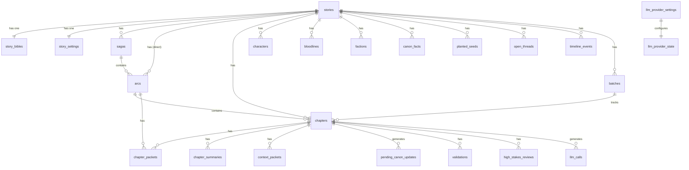

# Novel graph — database

## database-erd

`database/database-erd.md`

---
type: reference
---

Database ERD Diagram
Full entity-relationship diagram for all 23 tables across 5 domains. Managed by [[packages/package-db]] (Drizzle ORM). Primary store: [[external-services/service-postgresql]].

Database ERD Table Summaries Story Domain
| Table | Key Columns | Purpose |
|-------|------------|---------|
| [[database/tables/stories]] | `id`, `title`, `genre`, `status` | Root entity; all other tables belong to a story |
| [[database/tables/story-bibles]] | `storyId`, `content`, `styleGuide`, `powerSystem` | Narrative foundation; loaded into HOT tier context |
| [[database/tables/story-settings]] | `storyId`, `modelRoutes`, `budgetOverrides`, `contextWindowSizes` | Per-story config overrides — loaded via `getEffectiveConfig()` |
| [[database/tables/sagas]] | `storyId`, `number`, `title`, `rollingSummary` | Multi-arc story segments; rolling summary in WARM tier |
| [[database/tables/arcs]] | `storyId`, `sagaId`, `number`, `title`, `rollingSummary` | Narrative arcs within sagas; summary in WARM tier |
| [[database/tables/batches]] | `storyId`, `mode`, `status`, `completedChapters`, `pausedReason` | Tracks batch generation runs; holds mode (safe/semi_auto/full_auto) |

Database ERD Table Summaries Chapter Domain
| Table | Key Columns | Purpose |
|-------|------------|---------|
| [[database/tables/chapters]] | `storyId`, `arcId`, `number`, `title`, `content`, `status`, `wordCount`, `deterministicValidation` | Generated chapter prose + all metadata; central write target |
| [[database/tables/chapter-packets]] | `chapterId`, `arcId`, `packet` (JSON) | Planning packets (goals, beats, character intents) generated by [[agents/packet-generator]] |
| [[database/tables/chapter-summaries]] | `chapterId`, `summary`, `embedding` (vector 1536) | Compact summaries + embeddings for COLD tier past-chapter retrieval |
| [[database/tables/context-packets]] | `chapterId`, `hotTierHash`, `warmTierHash`, `contextSnapshot` | Full context snapshots for observability; written by [[modules/context-builder]] |

Database ERD Table Summaries Canon Domain
| Table | Key Columns | Purpose |
|-------|------------|---------|
| [[database/tables/characters]] | `storyId`, `name`, `realmLevel`, `status`, `attributes` (JSON) | Character roster; active characters loaded into WARM tier |
| [[database/tables/bloodlines]] | `storyId`, `name`, `description`, `abilities` | Cultivation bloodline lineages; used by check-new-bloodline-source validator |
| [[database/tables/factions]] | `storyId`, `name`, `description`, `allegiance` | Political/martial factions for world coherence |
| [[database/tables/canon-facts]] | `storyId`, `content`, `embedding` (vector 1536), `locked`, `source` | Established world facts; `locked = true` blocks any contradiction |
| [[database/tables/pending-canon-updates]] | `chapterId`, `type`, `proposedData`, `status`, `conflictDetails` | Updates staged by [[modules/canon-merger]] awaiting human approve/reject |
| [[database/tables/planted-seeds]] | `storyId`, `content`, `dueChapter`, `paidOff` | Narrative hooks (foreshadowing) to resolve in future chapters; loaded into COLD tier |
| [[database/tables/open-threads]] | `storyId`, `content`, `status` | Unresolved plot threads tracked across chapters; loaded into WARM tier |
| [[database/tables/timeline-events]] | `storyId`, `chapterId`, `event`, `happenedAt` | Ordered story event log for temporal consistency |

Database ERD Table Summaries Validation Domain
| Table | Key Columns | Purpose |
|-------|------------|---------|
| [[database/tables/validations]] | `chapterId`, `type` (deterministic/llm), `results` (JSON), `severity`, `pass` | All validation results from [[validators/deterministic-runner]] and [[agents/llm-validator]] |
| [[database/tables/high-stakes-reviews]] | `chapterId`, `triggerReason`, `findings`, `severity`, `approve`, `recommendedActions` | Async deep-review outputs from [[agents/high-stakes-reviewer]] |

Database ERD Table Summaries Observability Domain
| Table | Key Columns | Purpose |
|-------|------------|---------|
| [[database/tables/llm-calls]] | `storyId`, `chapterId`, `agentRole`, `model`, `inputTokens`, `outputTokens`, `costUsd`, `latencyMs`, `promptText?` | Per-call LLM usage log; primary source for budget enforcement |
| [[database/tables/llm-provider-settings]] | `providerName`, `modelRoutes` (JSON), `isActive`, `config` (JSON) | Stored provider configuration + model routing overrides |
| [[database/tables/llm-provider-state]] | `activeProvider`, `updatedAt` | Singleton row: the currently active provider name |

Database ERD Vector Columns
Two tables use `pgvector` for semantic retrieval:
- `chapter_summaries.embedding` — powers past-chapter retrieval in COLD tier (top 3 by similarity)
- `canon_facts.embedding` — powers fact retrieval in COLD tier (top 8 by similarity)
Both are generated by [[modules/embedding-service]] when records are inserted.

Database ERD Managed By
[[packages/package-db]] — schema in `packages/db/src/schema/`, migrations via `pnpm db:generate` + `pnpm db:migrate`

Database ERD Related
- [[architecture/system-architecture]]
- [[flows/chapter-generation-flow]]
- [[external-services/service-postgresql]]

---

## arcs

`database/tables/arcs.md`

---
type: database-table
source: packages/db/src/schema/arcs.ts
---

Table: `arcs` Purpose
Stores arc-level story structure within a saga. Arcs define the mid-level narrative blocks, including planned character and power changes, seeds to resolve, and a rolling summary for context injection.

Table: `arcs` Important Columns
| Column | Type | Notes |
|--------|------|-------|
| `id` | uuid | Primary key |
| `storyId` | uuid | FK → `stories` |
| `sagaId` | uuid | FK → `sagas` |
| `arcNumber` | int | Sequential arc index within the story |
| `title` | text | Arc title |
| `premise` | text | Arc premise |
| `startChapter` | int | First chapter of this arc |
| `endChapter` | int | Last chapter (nullable until planned) |
| `summary` | text | Static authored summary |
| `mainConflict` | text | Central conflict for the arc |
| `expectedChanges` | text | Expected story-world changes by arc end |
| `seedsToResolveInArc` | jsonb | Planted seed IDs that should pay off |
| `expectedCharacterChanges` | jsonb | Planned character evolution |
| `expectedPowerChanges` | jsonb | Planned cultivation breakthroughs |
| `rollingSummary` | text | Continuously updated arc summary |
| `summaryVersion` | int | Increments on each summary refresh |
| `plantedSeedIds` | jsonb | Seeds planted during this arc |
| `status` | text | `planned` / `active` / `completed` |
| `summaryUpdatedAt` | timestamptz | Last time rollingSummary was refreshed |

Table: `arcs` Primary Key
`id` (uuid)

Table: `arcs` Foreign Keys
- `storyId` → `stories.id`
- `sagaId` → `sagas.id`

Table: `arcs` Read By
- [[modules/context-builder]]
- [[jobs/job-generate-chapter]]
- [[jobs/job-generate-batch]]

Table: `arcs` Written By
- [[agents/arc-planner]]
- [[jobs/job-refresh-arc-summary]]

Table: `arcs` Updated By
- [[jobs/job-refresh-arc-summary]]

Table: `arcs` Related Domain Concepts
- [[domain-story]]
- [[domain-planted-seed]]

Table: `arcs` Related Flows
- [[flows/chapter-generation-flow]]
- [[flows/batch-generation-flow]]
---
type: database-table
source: packages/db/src/schema/arcs.ts
---

Table: `arcs` Purpose
Arc records within a saga. 2–5 arcs per saga. Has rolling summary refreshed every 5 chapters.

Table: `arcs` Important Columns
| Column | Type | Notes |
|--------|------|-------|
| id | uuid | Primary key |
| storyId | uuid | FK → stories |
| sagaId | uuid | FK → sagas |
| arcNumber | int | Ordinal position within the saga |
| title | text | Arc title |
| premise | text | Arc premise |
| startChapter | int | First chapter number |
| endChapter | int | Last chapter number |
| summary | text | Static arc summary |
| mainConflict | text | Central conflict of the arc |
| expectedChanges | jsonb | Planned world/character changes |
| seedsToResolveInArc | jsonb | Seeds that must pay off in this arc |
| expectedCharacterChanges | jsonb | Planned character state changes |
| expectedPowerChanges | jsonb | Planned power/realm changes |
| rollingSummary | text | Continuously updated summary |
| summaryVersion | int | Version of the rolling summary |
| plantedSeedIds | jsonb | Seeds planted during this arc |
| status | text | Current arc status |
| summaryUpdatedAt | timestamp | When the rolling summary was last updated |

Table: `arcs` Primary Key
`id` (uuid)

Table: `arcs` Foreign Keys
- `storyId` → `stories`
- `sagaId` → `sagas`

Table: `arcs` Read By
- [[modules/context-builder]]
- [[jobs/job-generate-chapter]]
- [[jobs/job-generate-batch]]
- [[jobs/job-refresh-arc-summary]]

Table: `arcs` Written By
- [[agents/arc-planner]]
- [[jobs/job-refresh-arc-summary]]

Table: `arcs` Related Domain Concepts
- [[domain/story]]
- [[domain/planted-seed]]

Table: `arcs` Related Flows
- [[flows/chapter-generation-flow]]
- [[flows/batch-generation-flow]]

---

## batches

`database/tables/batches.md`

---
type: database-table
source: packages/db/src/schema/batches.ts
---

Table: `batches` Purpose
Tracks multi-chapter generation batches, including their mode (`safe` / `semi_auto` / `full_auto`), progress, pause state, and accumulated cost. A batch orchestrates repeated invocations of the chapter generation pipeline.

Table: `batches` Important Columns
| Column | Type | Notes |
|--------|------|-------|
| `id` | uuid | Primary key |
| `storyId` | uuid | FK → `stories` |
| `startChapter` | int | First chapter number in the batch |
| `endChapter` | int | Last chapter number in the batch |
| `mode` | enum | `safe` / `semi_auto` / `full_auto` |
| `status` | enum | `pending` / `running` / `paused` / `completed` / `failed` / `cancelled` |
| `pausedReason` | text | Why the batch was paused (nullable) |
| `completedChapters` | int | Count of successfully generated chapters |
| `totalCostUsd` | numeric | Accumulated cost for this batch |
| `meta` | jsonb | Arbitrary metadata for the batch run |
| `createdAt` | timestamptz | Row creation time |
| `updatedAt` | timestamptz | Last modification time |

Table: `batches` Primary Key
`id` (uuid)

Table: `batches` Foreign Keys
- `storyId` → `stories.id`

Table: `batches` Read By
- [[jobs/job-generate-batch]]
- [[routes/route-batches]]

Table: `batches` Written By
- [[routes/route-batches]]
- [[jobs/job-generate-batch]]

Table: `batches` Updated By
- [[jobs/job-generate-batch]]

Table: `batches` Related Domain Concepts
- [[domain-generation-mode]]

Table: `batches` Related Flows
- [[flows/batch-generation-flow]]
---
type: database-table
source: packages/db/src/schema/batches.ts
---

Table: `batches` Purpose
Batch generation jobs — tracks multi-chapter generation runs with mode, status, and progress.

Table: `batches` Important Columns
| Column | Type | Notes |
|--------|------|-------|
| id | uuid | Primary key |
| storyId | uuid | FK → stories |
| startChapter | int | First chapter in the batch |
| endChapter | int | Last chapter in the batch |
| mode | enum | `safe` / `semi_auto` / `full_auto` |
| status | enum | `pending` / `running` / `paused` / `completed` / `failed` / `cancelled` |
| pausedReason | text | Why the batch was paused (if applicable) |
| completedChapters | int | Number of chapters successfully generated |
| totalCostUsd | numeric | Total cost of the batch |
| meta | jsonb | Additional metadata |
| createdAt | timestamp | Creation timestamp |
| updatedAt | timestamp | Last update timestamp |

Table: `batches` Primary Key
`id` (uuid)

Table: `batches` Foreign Keys
- `storyId` → `stories`

Table: `batches` Read By
- [[jobs/job-generate-batch]]
- [[routes/route-batches]]

Table: `batches` Written By
- [[routes/route-batches]]
- [[jobs/job-generate-batch]]

Table: `batches` Related Domain Concepts
- [[domain/generation-mode]]

Table: `batches` Related Flows
- [[flows/batch-generation-flow]]

---

## bloodlines

`database/tables/bloodlines.md`

---
type: database-table
source: packages/db/src/schema/bloodlines.ts
---

Table: `bloodlines` Purpose
Stores the canon registry of bloodlines in the story — their rank, source, traits, risks, and evolution paths. Used to validate that new bloodline sources are not contradicted by existing canon.

Table: `bloodlines` Important Columns
| Column | Type | Notes |
|--------|------|-------|
| `id` | uuid | Primary key |
| `storyId` | uuid | FK → `stories` |
| `name` | text | Bloodline name |
| `rank` | text | Power rank / rarity tier |
| `source` | text | Origin of the bloodline |
| `traits` | jsonb | Abilities and passive traits granted |
| `risks` | text | Known drawbacks or dangers |
| `compatibility` | jsonb | Compatible/incompatible bloodlines |
| `evolutionPath` | text | How the bloodline can grow |
| `notes` | text | Free-form canon notes |

Table: `bloodlines` Primary Key
`id` (uuid)

Table: `bloodlines` Foreign Keys
- `storyId` → `stories.id`

Table: `bloodlines` Read By
- [[modules/context-builder]]
- [[validators/check-new-bloodline-source]]

Table: `bloodlines` Written By
- [[modules/canon-merger]]
- [[agents/canon-extractor]]

Table: `bloodlines` Updated By
- [[modules/canon-merger]]

Table: `bloodlines` Related Domain Concepts
- [[domain-cultivation-realm]]

Table: `bloodlines` Related Flows
- [[flows/canon-reconciliation-flow]]
---
type: database-table
source: packages/db/src/schema/bloodlines.ts
---

Table: `bloodlines` Purpose
Bloodline / bloodline awakening records for cultivation system.

Table: `bloodlines` Important Columns
| Column | Type | Notes |
|--------|------|-------|
| id | uuid | Primary key |
| storyId | uuid | FK → stories |
| name | text | Bloodline name |
| rank | text | Power rank of the bloodline |
| source | text | Origin of the bloodline |
| traits | jsonb | Granted traits/abilities |
| risks | text | Associated risks or drawbacks |
| compatibility | jsonb | Compatible bloodlines or systems |
| evolutionPath | text | How the bloodline evolves |
| notes | text | Free-form canon notes |

Table: `bloodlines` Primary Key
`id` (uuid)

Table: `bloodlines` Foreign Keys
- `storyId` → `stories`

Table: `bloodlines` Read By
- [[modules/context-builder]]
- [[validators/check-new-bloodline-source]]

Table: `bloodlines` Written By
- [[modules/canon-merger]]
- [[agents/canon-extractor]]

Table: `bloodlines` Related Domain Concepts
- [[domain/cultivation-realm]]

Table: `bloodlines` Related Flows
- [[flows/canon-reconciliation-flow]]

---

## canon-facts

`database/tables/canon-facts.md`

---
type: database-table
source: packages/db/src/schema/canon-facts.ts
---

Table: `canon_facts` Purpose
Stores atomic, locked or unlocked facts about the story world — statements of truth that generation must never contradict. Supports vector similarity search for relevant fact retrieval in the COLD context tier.

Table: `canon_facts` Important Columns
| Column | Type | Notes |
|--------|------|-------|
| `id` | uuid | Primary key |
| `storyId` | uuid | FK → `stories` |
| `topic` | text | Thematic category / tag for the fact |
| `fact` | text | The canonical statement |
| `sourceChapter` | int | Chapter that established this fact |
| `importance` | text | `low` / `medium` / `high` |
| `locked` | boolean | If true, cannot be overwritten by auto-merge |
| `tags` | jsonb | Searchable tag array |
| `embedding` | vector(1536) | Semantic embedding for vector retrieval |
| `createdAt` | timestamptz | Row creation time |

Table: `canon_facts` Primary Key
`id` (uuid)

Table: `canon_facts` Foreign Keys
- `storyId` → `stories.id`

Table: `canon_facts` Read By
- [[modules/context-builder]] (COLD tier — vector retrieval)
- [[validators/check-locked-fact]]
- [[modules/conflict-detector]]

Table: `canon_facts` Written By
- [[modules/canon-merger]]
- [[agents/canon-extractor]]

Table: `canon_facts` Updated By
- [[modules/canon-merger]]

Table: `canon_facts` Related Domain Concepts
- [[domain-canon-fact]]

Table: `canon_facts` Related Flows
- [[flows/chapter-generation-flow]]
- [[flows/canon-reconciliation-flow]]
---
type: database-table
source: packages/db/src/schema/canon-facts.ts
---

Table: `canon_facts` Purpose
Canonical facts about the world — with semantic embeddings and optional locking.

Table: `canon_facts` Important Columns
| Column | Type | Notes |
|--------|------|-------|
| id | uuid | Primary key |
| storyId | uuid | FK → stories |
| topic | text | Topic / category of the fact |
| fact | text | The canonical fact text |
| sourceChapter | int | Chapter where the fact was established |
| importance | text | Importance level of the fact |
| locked | boolean | If true, cannot be auto-merged away |
| tags | jsonb | Searchable tags |
| embedding | vector(1536) | Semantic embedding for retrieval |
| createdAt | timestamp | Creation timestamp |

Table: `canon_facts` Primary Key
`id` (uuid)

Table: `canon_facts` Foreign Keys
- `storyId` → `stories`

Table: `canon_facts` Read By
- [[modules/context-builder]] (COLD tier vector retrieval)
- [[validators/check-locked-fact]]
- [[modules/conflict-detector]]
- [[validators/check-unknown-location]]

Table: `canon_facts` Written By
- [[modules/canon-merger]]
- [[agents/canon-extractor]]

Table: `canon_facts` Related Domain Concepts
- [[domain/canon-fact]]

Table: `canon_facts` Related Flows
- [[flows/chapter-generation-flow]]
- [[flows/canon-reconciliation-flow]]

---

## chapter-packets

`database/tables/chapter-packets.md`

---
type: database-table
source: packages/db/src/schema/chapter-packets.ts
---

Table: `chapter_packets` Purpose
Stores the structured `ChapterPacket` produced by `PacketGenerator` and audited by `PacketAuditor`. Serves as the micro-plan for a single chapter that feeds the COLD tier of the context cache.

Table: `chapter_packets` Important Columns
| Column | Type | Notes |
|--------|------|-------|
| `id` | uuid | Primary key |
| `storyId` | uuid | FK → `stories` |
| `chapterId` | uuid | FK → `chapters` |
| `arcId` | uuid | FK → `arcs` |
| `chapterNumber` | int | Denormalised for easy lookup |
| `goal` | text | The chapter's narrative goal |
| `requiredEvents` | jsonb | Events that must occur in this chapter |
| `charactersInScene` | jsonb | Character IDs present in this chapter |
| `conflict` | text | The core conflict to be dramatised |
| `cliffhanger` | text | Intended ending hook |
| `forbiddenMoves` | jsonb | Actions forbidden by packet audit |
| `contextNotes` | text | Additional planner notes for the writer |

Table: `chapter_packets` Primary Key
`id` (uuid)

Table: `chapter_packets` Foreign Keys
- `storyId` → `stories.id`
- `chapterId` → `chapters.id`
- `arcId` → `arcs.id`

Table: `chapter_packets` Read By
- [[modules/context-builder]] (COLD tier)

Table: `chapter_packets` Written By
- [[jobs/job-generate-chapter]] (after PacketGenerator + PacketAuditor pass)

Table: `chapter_packets` Updated By
- [[jobs/job-generate-chapter]]

Table: `chapter_packets` Related Domain Concepts
- [[domain-chapter-packet]]

Table: `chapter_packets` Related Flows
- [[flows/chapter-generation-flow]]
---
type: database-table
source: packages/db/src/schema/chapter-packets.ts
---

Table: `chapter_packets` Purpose
Structured chapter plan — goal, events, characters in scene, conflict, cliffhanger, forbidden moves.

Table: `chapter_packets` Important Columns
| Column | Type | Notes |
|--------|------|-------|
| id | uuid | Primary key |
| storyId | uuid | FK → stories |
| chapterId | uuid | FK → chapters |
| arcId | uuid | FK → arcs |
| chapterNumber | int | Denormalized chapter number |
| goal | text | Primary goal for the chapter |
| requiredEvents | jsonb | Events that must occur |
| charactersInScene | jsonb | Characters appearing in this chapter |
| conflict | text | Central conflict of the chapter |
| cliffhanger | text | Ending hook / cliffhanger |
| forbiddenMoves | jsonb | Moves the writer must not make |
| contextNotes | text | Additional planner notes |

Table: `chapter_packets` Primary Key
`id` (uuid)

Table: `chapter_packets` Foreign Keys
- `storyId` → `stories`
- `chapterId` → `chapters`
- `arcId` → `arcs`

Table: `chapter_packets` Read By
- [[modules/context-builder]] (COLD tier)
- [[validators/packet-auditor]]

Table: `chapter_packets` Written By
- [[jobs/job-generate-chapter]] (Stage 3)

Table: `chapter_packets` Related Domain Concepts
- [[domain/chapter-packet]]

Table: `chapter_packets` Related Flows
- [[flows/chapter-generation-flow]]

---

## chapter-summaries

`database/tables/chapter-summaries.md`

---
type: database-table
source: packages/db/src/schema/chapter-summaries.ts
---

Table: `chapter_summaries` Purpose
Stores the compact summary and semantic embedding for every completed chapter. Powers both recency-based COLD tier context retrieval and vector similarity search for relevant past events.

Table: `chapter_summaries` Important Columns
| Column | Type | Notes |
|--------|------|-------|
| `chapterId` | uuid | PK and FK → `chapters` |
| `storyId` | uuid | FK → `stories` |
| `chapterNumber` | int | Denormalised for ordered retrieval |
| `summary` | text | Compact narrative summary |
| `embedding` | vector(1536) | Semantic embedding for vector search |
| `createdAt` | timestamptz | Row creation time |

Table: `chapter_summaries` Primary Key
`chapterId` (uuid) — one summary per chapter

Table: `chapter_summaries` Foreign Keys
- `chapterId` → `chapters.id`
- `storyId` → `stories.id`

Table: `chapter_summaries` Read By
- [[modules/context-builder]] (COLD tier — recent summaries + vector retrieval)
- [[jobs/job-refresh-arc-summary]]

Table: `chapter_summaries` Written By
- [[agents/summary-compactor]] via [[jobs/job-generate-chapter]]

Table: `chapter_summaries` Updated By
- [[agents/summary-compactor]]

Table: `chapter_summaries` Related Domain Concepts
- [[domain-chapter-context]]

Table: `chapter_summaries` Related Flows
- [[flows/chapter-generation-flow]]
---
type: database-table
source: packages/db/src/schema/chapter-summaries.ts
---

Table: `chapter_summaries` Purpose
Short chapter summaries with 1536-dim vector embeddings for semantic retrieval.

Table: `chapter_summaries` Important Columns
| Column | Type | Notes |
|--------|------|-------|
| chapterId | uuid | PK and FK → chapters |
| storyId | uuid | FK → stories |
| chapterNumber | int | Denormalized chapter number |
| summary | text | Short chapter summary text |
| embedding | vector(1536) | Semantic embedding for retrieval |
| createdAt | timestamp | Creation timestamp |

Table: `chapter_summaries` Primary Key
`chapterId` (uuid — 1:1 with chapters)

Table: `chapter_summaries` Foreign Keys
- `chapterId` → `chapters`
- `storyId` → `stories`

Table: `chapter_summaries` Read By
- [[modules/context-builder]] (COLD tier — recent + vector retrieval)
- [[jobs/job-refresh-arc-summary]]

Table: `chapter_summaries` Written By
- [[agents/summary-compactor]] via [[jobs/job-generate-chapter]]

Table: `chapter_summaries` Related Domain Concepts
- [[domain/chapter-context]]

Table: `chapter_summaries` Related Flows
- [[flows/chapter-generation-flow]]

---

## chapters

`database/tables/chapters.md`

---
type: database-table
source: packages/db/src/schema/chapters.ts
---

Table: `chapters` Purpose
Stores the generated content and lifecycle state of every chapter. Tracks validation status, packet audit results, and links to the LLM validation record.

Table: `chapters` Important Columns
| Column | Type | Notes |
|--------|------|-------|
| `id` | uuid | Primary key |
| `storyId` | uuid | FK → `stories` |
| `arcId` | uuid | FK → `arcs` |
| `chapterNumber` | int | Unique per story |
| `title` | text | Chapter title |
| `content` | text | Full generated prose |
| `summary` | text | Short chapter summary |
| `status` | enum | `draft` / `generating` / `completed` / `failed` / `paused_pending_updates` |
| `wordCount` | int | Word count of generated content |
| `validationStatus` | text | Result of LLM validation pass |
| `packetAuditStatus` | text | Result of deterministic packet audit |
| `deterministicValidation` | jsonb | Output of DeterministicValidator |
| `llmValidationId` | uuid | FK → `validations` |
| `contextCacheKey` | text | Hash key for context cache hit tracking |
| `createdAt` | timestamptz | Row creation time |
| `updatedAt` | timestamptz | Last modification time |

Table: `chapters` Primary Key
`id` (uuid)

Table: `chapters` Foreign Keys
- `storyId` → `stories.id`
- `arcId` → `arcs.id`
- `llmValidationId` → `validations.id`

Table: `chapters` Read By
- [[jobs/job-generate-batch]]
- [[routes/route-chapters]]
- [[modules/context-builder]]

Table: `chapters` Written By
- [[jobs/job-generate-chapter]]
- [[routes/route-chapters]]

Table: `chapters` Updated By
- [[jobs/job-generate-chapter]]

Table: `chapters` Related Domain Concepts
- [[domain-chapter-context]]

Table: `chapters` Related Flows
- [[flows/chapter-generation-flow]]
- [[flows/validation-flow]]
---
type: database-table
source: packages/db/src/schema/chapters.ts
---

Table: `chapters` Purpose
Generated chapter records with content, validation status, word count.

Table: `chapters` Important Columns
| Column | Type | Notes |
|--------|------|-------|
| id | uuid | Primary key |
| storyId | uuid | FK → stories |
| arcId | uuid | FK → arcs |
| chapterNumber | int | Unique per story |
| title | text | Chapter title |
| content | text | Full chapter text |
| summary | text | Short chapter summary |
| status | enum | `draft` / `generating` / `completed` / `failed` / `paused_pending_updates` |
| wordCount | int | Word count of generated content |
| validationStatus | text | Current validation status |
| packetAuditStatus | text | Status from packet auditor |
| deterministicValidation | jsonb | Result of deterministic validation checks |
| llmValidationId | uuid | FK → validations (nullable) |
| contextCacheKey | text | Cache key for the context used |
| createdAt | timestamp | Creation timestamp |
| updatedAt | timestamp | Last update timestamp |

Table: `chapters` Primary Key
`id` (uuid)

Table: `chapters` Foreign Keys
- `storyId` → `stories`
- `arcId` → `arcs`
- `llmValidationId` → `validations` (nullable)

Table: `chapters` Read By
- [[jobs/job-generate-batch]]
- [[routes/route-chapters]]
- [[modules/context-builder]]
- [[jobs/job-high-stakes-review]]

Table: `chapters` Written By
- [[jobs/job-generate-chapter]]
- [[routes/route-chapters]]

Table: `chapters` Related Domain Concepts
- [[domain/chapter-context]]

Table: `chapters` Related Flows
- [[flows/chapter-generation-flow]]
- [[flows/validation-flow]]

---

## characters

`database/tables/characters.md`

---
type: database-table
source: packages/db/src/schema/characters.ts
---

Table: `characters` Purpose
Stores the canonical profile of every character in the story, including their current realm, abilities, relationships, and status. Updated after each chapter via canon reconciliation.

Table: `characters` Important Columns
| Column | Type | Notes |
|--------|------|-------|
| `id` | uuid | Primary key |
| `storyId` | uuid | FK → `stories` |
| `version` | int | Increments on each canon update |
| `name` | text | Character name |
| `role` | enum | `main` / `supporting` / `antagonist` / `minor` |
| `personality` | text | Personality description |
| `origin` | text | Background and origins |
| `goals` | text | Current narrative goals |
| `currentRealm` | text | Cultivation realm as of last chapter |
| `currentBloodlines` | jsonb | Active bloodlines |
| `abilities` | jsonb | Known skills and powers |
| `secrets` | text | Hidden info (not revealed to reader) |
| `relationships` | jsonb | Key relationships to other characters |
| `inventory` | jsonb | Notable items carried |
| `status` | enum | `alive` / `dead` / `unknown` |
| `lastSeenChapter` | int | Last chapter where character appeared |
| `canonNotes` | text | Free-form canon annotations |
| `lockedFields` | jsonb array | Fields that cannot be overwritten by auto-merge |
| `createdAt` | timestamptz | Row creation time |
| `updatedAt` | timestamptz | Last modification time |

Table: `characters` Primary Key
`id` (uuid)

Table: `characters` Foreign Keys
- `storyId` → `stories.id`

Table: `characters` Read By
- [[modules/context-builder]]
- [[validators/check-dead-character]]
- [[validators/check-realm-jump]]
- [[validators/check-unknown-character]]

Table: `characters` Written By
- [[modules/canon-merger]]
- [[agents/canon-extractor]]
- [[routes/route-arcs]] (initial character seeding)

Table: `characters` Updated By
- [[modules/canon-merger]]

Table: `characters` Related Domain Concepts
- [[domain-canon-fact]]
- [[domain-cultivation-realm]]

Table: `characters` Related Flows
- [[flows/canon-reconciliation-flow]]
- [[flows/chapter-generation-flow]]
---
type: database-table
source: packages/db/src/schema/characters.ts
---

Table: `characters` Purpose
Versioned character records — state, realm, abilities, relationships, locked fields.

Table: `characters` Important Columns
| Column | Type | Notes |
|--------|------|-------|
| id | uuid | Primary key |
| storyId | uuid | FK → stories |
| version | int | Incremented on each revision |
| name | text | Character name |
| role | enum | `main` / `supporting` / `antagonist` / `minor` |
| personality | text | Personality descriptor |
| origin | text | Background / origin |
| goals | text | Character goals |
| currentRealm | text | Current cultivation realm |
| currentBloodlines | jsonb | Active bloodlines |
| abilities | jsonb | Known abilities |
| secrets | text | Hidden information |
| relationships | jsonb | Relationships to other characters |
| inventory | jsonb | Notable items |
| status | enum | `alive` / `dead` / `unknown` |
| lastSeenChapter | int | Last chapter the character appeared in |
| canonNotes | text | Free-form canon notes |
| lockedFields | jsonb | Fields that cannot be changed by auto-merge |
| createdAt | timestamp | Creation timestamp |
| updatedAt | timestamp | Last update timestamp |

Table: `characters` Primary Key
`id` (uuid)

Table: `characters` Foreign Keys
- `storyId` → `stories`

Table: `characters` Read By
- [[modules/context-builder]]
- [[validators/check-dead-character]]
- [[validators/check-realm-jump]]
- [[validators/check-unknown-character]]
- [[modules/conflict-detector]]

Table: `characters` Written By
- [[modules/canon-merger]]
- [[agents/canon-extractor]]

Table: `characters` Related Domain Concepts
- [[domain/canon-fact]]
- [[domain/cultivation-realm]]

Table: `characters` Related Flows
- [[flows/canon-reconciliation-flow]]
- [[flows/chapter-generation-flow]]

---

## context-packets

`database/tables/context-packets.md`

---
type: database-table
source: packages/db/src/schema/context-packets.ts
---

Table: `context_packets` Purpose
Records each assembled `ChapterContext` snapshot, including tier hashes and token counts. Used by admin metrics to measure context cache hit rates and to debug context assembly.

Table: `context_packets` Important Columns
| Column | Type | Notes |
|--------|------|-------|
| `id` | uuid | Primary key |
| `chapterId` | uuid | FK → `chapters` |
| `hotTierHash` | text | Hash of stable HOT tier content (bible, style, etc.) |
| `warmTierHash` | text | Hash of WARM tier content (summaries, threads, seeds) |
| `coldPayload` | jsonb | Serialised COLD tier content for this build |
| `totalInputTokens` | int | Total tokens passed to the LLM |
| `cachedInputTokens` | int | Tokens served from provider-side cache |
| `configSnapshot` | jsonb | Snapshot of `EffectiveConfig` at build time |
| `createdAt` | timestamptz | Row creation time |

Table: `context_packets` Primary Key
`id` (uuid)

Table: `context_packets` Foreign Keys
- `chapterId` → `chapters.id`

Table: `context_packets` Read By
- [[modules/admin-metrics]] (cache hit rate statistics)

Table: `context_packets` Written By
- [[modules/context-builder]] via [[jobs/job-generate-chapter]]

Table: `context_packets` Updated By
N/A — append-only observability record.

Table: `context_packets` Related Domain Concepts
- [[domain-chapter-context]]

Table: `context_packets` Related Flows
- [[flows/chapter-generation-flow]]
---
type: database-table
source: packages/db/src/schema/context-packets.ts
---

Table: `context_packets` Purpose
Snapshot of context used for each chapter generation — hot/warm hashes for cache analysis, cold payload, token counts.

Table: `context_packets` Important Columns
| Column | Type | Notes |
|--------|------|-------|
| id | uuid | Primary key |
| chapterId | uuid | FK → chapters |
| hotTierHash | text | Hash of the HOT tier content |
| warmTierHash | text | Hash of the WARM tier content |
| coldPayload | jsonb | Full serialized COLD tier payload |
| totalInputTokens | int | Total tokens sent to the model |
| cachedInputTokens | int | Tokens served from cache |
| configSnapshot | jsonb | EffectiveConfig snapshot at generation time |
| createdAt | timestamp | Creation timestamp |

Table: `context_packets` Primary Key
`id` (uuid)

Table: `context_packets` Foreign Keys
- `chapterId` → `chapters`

Table: `context_packets` Read By
- [[modules/admin-metrics]] (cache hit rate stats)

Table: `context_packets` Written By
- [[modules/context-builder]] via [[jobs/job-generate-chapter]]

Table: `context_packets` Related Domain Concepts
- [[domain/chapter-context]]

Table: `context_packets` Related Flows
- [[flows/chapter-generation-flow]]

---

## factions

`database/tables/factions.md`

---
type: database-table
source: packages/db/src/schema/factions.ts
---

Table: `factions` Purpose
Stores canonical faction records — organisations, sects, and alliances that exist within the story world. Updated through canon reconciliation after each chapter.

Table: `factions` Important Columns
| Column | Type | Notes |
|--------|------|-------|
| `id` | uuid | Primary key |
| `storyId` | uuid | FK → `stories` |
| `name` | text | Faction name |
| `type` | text | Category (sect, clan, empire, etc.) |
| `ideology` | text | Core beliefs and motivations |
| `powerLevel` | text | Relative strength descriptor |
| `knownMembers` | jsonb | List of known member character IDs or names |
| `alliances` | jsonb | Allied faction IDs |
| `enemies` | jsonb | Enemy faction IDs |
| `status` | text | Current state (active, destroyed, hidden, etc.) |
| `notes` | text | Free-form canon notes |

Table: `factions` Primary Key
`id` (uuid)

Table: `factions` Foreign Keys
- `storyId` → `stories.id`

Table: `factions` Read By
- [[modules/context-builder]] — `getFactionsForStory()` populates `WarmTier.knownFactions`
- [[validators/check-unknown-faction]] — flags Vietnamese faction-prefixed proper nouns missing from this table
- [[validators/check-unknown-location]] / [[validators/check-unknown-character]] — defensively suppress false positives

Table: `factions` Written By
- [[modules/canon-merger]] — `applyRow` case `factions` (auto mode) and route `POST /api/stories/:id/pending-updates/:updateId/approve` (review mode)
- [[agents/canon-extractor]] — emits `factionUpdates[]`

Table: `factions` Updated By
- [[modules/canon-merger]] — partial update path with locked-field + destroyed/absorbed guardrails

Table: `factions` Conflict Detection
- `duplicate_faction` — create rejected when the name already exists
- `destroyed_faction_action` — only `status` and `notes` may change on a destroyed/absorbed faction
- `locked_field` — destroyed/absorbed factions have `status` locked by snapshot construction

Table: `factions` Related Domain Concepts
- [[domain-story]]

Table: `factions` Related Flows
- [[flows/canon-reconciliation-flow]]
---
type: database-table
source: packages/db/src/schema/factions.ts
---

Table: `factions` Purpose
Faction/organization records — ideology, power level, alliances, enemies.

Table: `factions` Important Columns
| Column | Type | Notes |
|--------|------|-------|
| id | uuid | Primary key |
| storyId | uuid | FK → stories |
| name | text | Faction name |
| type | text | Organization type |
| ideology | text | Core beliefs / ideology |
| powerLevel | text | Relative power level |
| knownMembers | jsonb | List of known members |
| alliances | jsonb | Allied factions |
| enemies | jsonb | Enemy factions |
| status | text | Current faction status |
| notes | text | Free-form notes |

Table: `factions` Primary Key
`id` (uuid)

Table: `factions` Foreign Keys
- `storyId` → `stories`

Table: `factions` Read By
- [[modules/context-builder]] — `getFactionsForStory()` populates `WarmTier.knownFactions`
- [[validators/check-unknown-faction]]

Table: `factions` Written By
- [[modules/canon-merger]] — `applyRow` case `factions`
- [[agents/canon-extractor]] — `factionUpdates[]`

Table: `factions` Related Domain Concepts
- [[domain/story]]

Table: `factions` Related Flows
- [[flows/canon-reconciliation-flow]]

---

## high-stakes-reviews

`database/tables/high-stakes-reviews.md`

---
type: database-table
source: packages/db/src/schema/high-stakes-reviews.ts
---

Table: `high_stakes_reviews` Purpose
Stores the output of the `HighStakesReview` agent, which is triggered asynchronously at arc endings, on critical validation severity, or by manual request. Provides a human-readable assessment of the chapter's narrative impact.

Table: `high_stakes_reviews` Important Columns
| Column | Type | Notes |
|--------|------|-------|
| `id` | uuid | Primary key |
| `storyId` | uuid | FK → `stories` |
| `chapterId` | uuid | FK → `chapters` |
| `triggerReason` | enum | `arc_end` / `critical_severity` / `manual` |
| `approve` | boolean | Whether the reviewer approved the chapter |
| `concerns` | text | Narrative concerns raised by the reviewer |
| `recommendedActions` | text | Suggested follow-up actions |
| `tokens` | int | Token count for this review call |
| `costUsd` | numeric | Cost of this review call |
| `promptVersion` | text | Version of the high-stakes-reviewer prompt used |
| `createdAt` | timestamptz | Row creation time |

Table: `high_stakes_reviews` Primary Key
`id` (uuid)

Table: `high_stakes_reviews` Foreign Keys
- `storyId` → `stories.id`
- `chapterId` → `chapters.id`

Table: `high_stakes_reviews` Read By
- [[routes/route-reviews]]

Table: `high_stakes_reviews` Written By
- [[jobs/job-high-stakes-review]]
- [[agents/high-stakes-reviewer]]

Table: `high_stakes_reviews` Updated By
N/A — one review per trigger event.

Table: `high_stakes_reviews` Related Domain Concepts
- [[domain-canon-conflict]]

Table: `high_stakes_reviews` Related Flows
- [[flows/validation-flow]]
- [[flows/chapter-generation-flow]]
---
type: database-table
source: packages/db/src/schema/high-stakes-reviews.ts
---

Table: `high_stakes_reviews` Purpose
Records of deep LLM reviews at arc-end, critical severity, or manual trigger.

Table: `high_stakes_reviews` Important Columns
| Column | Type | Notes |
|--------|------|-------|
| id | uuid | Primary key |
| storyId | uuid | FK → stories |
| chapterId | uuid | FK → chapters |
| triggerReason | enum | `arc_end` / `critical_severity` / `manual` |
| approve | boolean | Whether the review approved the chapter |
| concerns | text | Concerns raised by the reviewer |
| recommendedActions | text | Suggested follow-up actions |
| tokens | int | Total tokens used for the review |
| costUsd | numeric | Cost of the review call |
| promptVersion | text | Version of the reviewer prompt |
| createdAt | timestamp | Creation timestamp |

Table: `high_stakes_reviews` Primary Key
`id` (uuid)

Table: `high_stakes_reviews` Foreign Keys
- `storyId` → `stories`
- `chapterId` → `chapters`

Table: `high_stakes_reviews` Read By
- [[routes/route-reviews]]

Table: `high_stakes_reviews` Written By
- [[jobs/job-high-stakes-review]]
- [[agents/high-stakes-reviewer]]

Table: `high_stakes_reviews` Related Domain Concepts
- [[domain/canon-conflict]]

Table: `high_stakes_reviews` Related Flows
- [[flows/validation-flow]]
- [[flows/chapter-generation-flow]]

---

## llm-calls

`database/tables/llm-calls.md`

---
type: database-table
source: packages/db/src/schema/llm-calls.ts
---

Table: `llm_calls` Purpose
Immutable log of every LLM API call made by any agent. Used for cost tracking, debugging, and per-story spend aggregation. Written by `LoggedLLMProvider` which wraps every provider.

Table: `llm_calls` Important Columns
| Column | Type | Notes |
|--------|------|-------|
| `id` | uuid | Primary key |
| `storyId` | uuid | FK → `stories` |
| `chapterId` | uuid | FK → `chapters` (nullable) |
| `agentRole` | text | The `AgentRole` that made the call |
| `model` | text | Model identifier used |
| `promptVersion` | text | Version tag of the prompt template used |
| `inputTokens` | int | Number of input tokens consumed |
| `outputTokens` | int | Number of output tokens produced |
| `cachedInputTokens` | int | Input tokens served from provider cache |
| `estimatedCostUsd` | numeric | Computed cost for this call |
| `traceId` | text | Correlation ID for distributed tracing |
| `createdAt` | timestamptz | Row creation time |

Table: `llm_calls` Primary Key
`id` (uuid)

Table: `llm_calls` Foreign Keys
- `storyId` → `stories.id`
- `chapterId` → `chapters.id` (nullable)

Table: `llm_calls` Read By
- [[modules/admin-metrics]]
- [[routes/route-costs]]

Table: `llm_calls` Written By
- [[modules/llm-call-logger]] (LoggedLLMProvider)

Table: `llm_calls` Updated By
N/A — append-only log table.

Table: `llm_calls` Related Domain Concepts
- [[domain-agent-role]]
- [[domain-budget-guardrails]]

Table: `llm_calls` Related Flows
- [[flows/llm-provider-flow]]
---
type: database-table
source: packages/db/src/schema/llm-calls.ts
---

Table: `llm_calls` Purpose
Observability log of every LLM call — tokens, cost, model, agent role, trace id.

Table: `llm_calls` Important Columns
| Column | Type | Notes |
|--------|------|-------|
| id | uuid | Primary key |
| storyId | uuid | FK → stories |
| chapterId | uuid | FK → chapters (nullable) |
| agentRole | text | The agent role that made the call |
| model | text | Model name used |
| promptVersion | text | Version of the prompt template |
| inputTokens | int | Number of input tokens |
| outputTokens | int | Number of output tokens |
| cachedInputTokens | int | Cached input tokens (if any) |
| estimatedCostUsd | numeric | Estimated cost of the call |
| traceId | text | Trace ID for grouping calls |
| createdAt | timestamp | Creation timestamp |

Table: `llm_calls` Primary Key
`id` (uuid)

Table: `llm_calls` Foreign Keys
- `storyId` → `stories`
- `chapterId` → `chapters` (nullable)

Table: `llm_calls` Read By
- [[modules/admin-metrics]]
- [[routes/route-costs]]
- [[modules/budget-guard]]

Table: `llm_calls` Written By
- [[modules/llm-call-logger]] (LoggedLLMProvider — every LLM call)

Table: `llm_calls` Related Domain Concepts
- [[domain/agent-role]]
- [[domain/budget-guardrails]]

Table: `llm_calls` Related Flows
- [[flows/llm-provider-flow]]

---

## llm-provider-settings

`database/tables/llm-provider-settings.md`

---
type: database-table
source: packages/db/src/schema/llm-settings.ts
---

Table: `llm_provider_settings` Purpose
Stores per-provider model route maps — the mapping of `AgentRole` to model identifier for each registered LLM provider. Overrides the compile-time `MODEL_CONFIG.routes` at runtime.

Table: `llm_provider_settings` Important Columns
| Column | Type | Notes |
|--------|------|-------|
| `provider` | text | PK — provider name (e.g. `google-direct`, `openrouter`) |
| `modelRoutes` | jsonb | Map of `AgentRole` → model string for this provider |

Table: `llm_provider_settings` Primary Key
`provider` (text)

Table: `llm_provider_settings` Foreign Keys
None.

Table: `llm_provider_settings` Read By
- [[modules/provider-switcher]]
- [[configs/config-models]]

Table: `llm_provider_settings` Written By
- [[routes/route-admin]] (`PUT /api/admin/models`)

Table: `llm_provider_settings` Updated By
- [[routes/route-admin]]

Table: `llm_provider_settings` Related Domain Concepts
- [[domain-agent-role]]

Table: `llm_provider_settings` Related Flows
- [[flows/llm-provider-flow]]
---
type: database-table
source: packages/db/src/schema/llm-settings.ts
---

Table: `llm_provider_settings` Purpose
Per-provider model route overrides — maps agent roles to specific model names.

Table: `llm_provider_settings` Important Columns
| Column | Type | Notes |
|--------|------|-------|
| provider | text | PK — provider name string (e.g. `google-direct`, `openrouter`) |
| modelRoutes | jsonb | Map of `AgentRole` → model name string |

Table: `llm_provider_settings` Primary Key
`provider` (text — one row per provider)

Table: `llm_provider_settings` Foreign Keys
None

Table: `llm_provider_settings` Read By
- [[modules/provider-switcher]]
- [[configs/config-models]]

Table: `llm_provider_settings` Written By
- [[routes/route-admin]] (`PUT /api/admin/models`)

Table: `llm_provider_settings` Related Domain Concepts
- [[domain/agent-role]]

Table: `llm_provider_settings` Related Flows
- [[flows/llm-provider-flow]]

---

## llm-provider-state

`database/tables/llm-provider-state.md`

---
type: database-table
source: packages/db/src/schema/llm-settings.ts
---

Table: `llm_provider_state` Purpose
Single-row global state table that tracks which LLM provider is currently active. All worker jobs snapshot this at dispatch time to ensure consistent provider selection within a job run.

Table: `llm_provider_state` Important Columns
| Column | Type | Notes |
|--------|------|-------|
| `id` | text | PK — always `'global'` (singleton row) |
| `activeProvider` | text | Name of the currently active LLM provider |
| `updatedAt` | timestamptz | Last time the active provider was changed |

Table: `llm_provider_state` Primary Key
`id` (text) — singleton, always `'global'`.

Table: `llm_provider_state` Foreign Keys
None.

Table: `llm_provider_state` Read By
- [[modules/provider-switcher]]
- All worker jobs (snapshot at dispatch)

Table: `llm_provider_state` Written By
- [[routes/route-admin]] (`PUT /api/admin/provider`)

Table: `llm_provider_state` Updated By
- [[routes/route-admin]]

Table: `llm_provider_state` Related Domain Concepts
- [[domain-agent-role]]

Table: `llm_provider_state` Related Flows
- [[flows/llm-provider-flow]]
---
type: database-table
source: packages/db/src/schema/llm-settings.ts
---

Table: `llm_provider_state` Purpose
Global singleton row that tracks which LLM provider is currently active.

Table: `llm_provider_state` Important Columns
| Column | Type | Notes |
|--------|------|-------|
| id | text | PK — always `'global'` (singleton pattern) |
| activeProvider | text | Name of the currently active provider |
| updatedAt | timestamp | When the active provider was last changed |

Table: `llm_provider_state` Primary Key
`id` = `'global'` (singleton — exactly one row)

Table: `llm_provider_state` Foreign Keys
None

Table: `llm_provider_state` Read By
- [[modules/provider-switcher]]
- All worker jobs (snapshot at dispatch)

Table: `llm_provider_state` Written By
- [[routes/route-admin]] (`PUT /api/admin/provider`)

Table: `llm_provider_state` Related Domain Concepts
- [[domain/agent-role]]

Table: `llm_provider_state` Related Flows
- [[flows/llm-provider-flow]]

---

## open-threads

`database/tables/open-threads.md`

---
type: database-table
source: packages/db/src/schema/open-threads.ts
---

Table: `open_threads` Purpose
Tracks unresolved narrative threads — mysteries, promises, and dangling plot hooks. Active open threads are injected into the WARM context tier so the writer keeps them in scope.

Table: `open_threads` Important Columns
| Column | Type | Notes |
|--------|------|-------|
| `id` | uuid | Primary key |
| `storyId` | uuid | FK → `stories` |
| `title` | text | Short thread title |
| `openedChapter` | int | Chapter where the thread was introduced |
| `plannedResolutionChapter` | int | Intended chapter for resolution (nullable) |
| `status` | enum | `open` / `resolved` / `dropped` |
| `hints` | text | Planted clues related to this thread |
| `relatedCharacters` | jsonb | Character IDs involved |
| `resolutionNotes` | text | How the thread was resolved (if resolved) |

Table: `open_threads` Primary Key
`id` (uuid)

Table: `open_threads` Foreign Keys
- `storyId` → `stories.id`

Table: `open_threads` Read By
- [[modules/context-builder]] (WARM tier)
- [[validators/check-conflict-presence]]

Table: `open_threads` Written By
- [[modules/canon-merger]]
- [[agents/canon-extractor]]

Table: `open_threads` Updated By
- [[modules/canon-merger]]

Table: `open_threads` Related Domain Concepts
- [[domain-open-thread]]

Table: `open_threads` Related Flows
- [[flows/chapter-generation-flow]]
- [[flows/canon-reconciliation-flow]]
---
type: database-table
source: packages/db/src/schema/open-threads.ts
---

Table: `open_threads` Purpose
Open narrative threads — unresolved plot points that must be tracked and resolved.

Table: `open_threads` Important Columns
| Column | Type | Notes |
|--------|------|-------|
| id | uuid | Primary key |
| storyId | uuid | FK → stories |
| title | text | Thread title / name |
| openedChapter | int | Chapter the thread was introduced |
| plannedResolutionChapter | int | Target chapter for resolution |
| status | enum | `open` / `resolved` / `dropped` |
| hints | text | Hints about the resolution |
| relatedCharacters | jsonb | Characters tied to this thread |
| resolutionNotes | text | How the thread was resolved |

Table: `open_threads` Primary Key
`id` (uuid)

Table: `open_threads` Foreign Keys
- `storyId` → `stories`

Table: `open_threads` Read By
- [[modules/context-builder]] (WARM tier)
- [[validators/check-conflict-presence]]
- [[modules/conflict-detector]]

Table: `open_threads` Written By
- [[modules/canon-merger]]
- [[agents/canon-extractor]]

Table: `open_threads` Related Domain Concepts
- [[domain/open-thread]]

Table: `open_threads` Related Flows
- [[flows/chapter-generation-flow]]
- [[flows/canon-reconciliation-flow]]

---

## pending-canon-updates

`database/tables/pending-canon-updates.md`

---
type: database-table
source: packages/db/src/schema/pending-canon-updates.ts
---

Table: `pending_canon_updates` Purpose
Staging area for canon changes extracted from newly generated chapters that could not be auto-merged due to conflicts or human-review policy. Human reviewers approve or reject each update before it propagates to canon tables.

Table: `pending_canon_updates` Important Columns
| Column | Type | Notes |
|--------|------|-------|
| `id` | uuid | Primary key |
| `storyId` | uuid | FK → `stories` |
| `chapterId` | uuid | FK → `chapters` |
| `updateType` | text | Type of change (upsert, delete, merge, etc.) |
| `targetTable` | text | Canon table to be updated (e.g. `characters`) |
| `targetId` | uuid | Row ID in the target table |
| `payload` | jsonb | The proposed new field values |
| `conflictStatus` | enum | `clean` / `conflict` / `escalated` |
| `conflictReasons` | jsonb | Explanation of why this was flagged |
| `resolution` | enum | `pending` / `approved` / `rejected` |
| `reviewedBy` | text | User or agent that reviewed this update |
| `resolvedAt` | timestamptz | When the resolution was made |
| `createdAt` | timestamptz | Row creation time |

Table: `pending_canon_updates` Primary Key
`id` (uuid)

Table: `pending_canon_updates` Foreign Keys
- `storyId` → `stories.id`
- `chapterId` → `chapters.id`

Table: `pending_canon_updates` Read By
- [[routes/route-pending-updates]]

Table: `pending_canon_updates` Written By
- [[modules/canon-merger]] (on conflict or when review mode is active)

Table: `pending_canon_updates` Updated By
- [[routes/route-pending-updates]] (on human approval/rejection)

Table: `pending_canon_updates` Related Domain Concepts
- [[domain-canon-conflict]]

Table: `pending_canon_updates` Related Flows
- [[flows/canon-reconciliation-flow]]
---
type: database-table
source: packages/db/src/schema/pending-canon-updates.ts
---

Table: `pending_canon_updates` Purpose
Staging table for canon updates that have conflicts or are in review mode — requires human approval before applying.

Table: `pending_canon_updates` Important Columns
| Column | Type | Notes |
|--------|------|-------|
| id | uuid | Primary key |
| storyId | uuid | FK → stories |
| chapterId | uuid | FK → chapters |
| updateType | text | Type of update being staged |
| targetTable | text | Which table the update targets |
| targetId | uuid | Row in the target table |
| payload | jsonb | The proposed update data |
| conflictStatus | enum | `clean` / `conflict` / `escalated` |
| conflictReasons | jsonb | Explanation of detected conflicts |
| resolution | enum | `pending` / `approved` / `rejected` |
| reviewedBy | text | Who reviewed the update |
| resolvedAt | timestamp | When the update was resolved |
| createdAt | timestamp | Creation timestamp |

Table: `pending_canon_updates` Primary Key
`id` (uuid)

Table: `pending_canon_updates` Foreign Keys
- `storyId` → `stories`
- `chapterId` → `chapters`

Table: `pending_canon_updates` Read By
- [[routes/route-pending-updates]]
- [[modules/admin-metrics]]

Table: `pending_canon_updates` Written By
- [[modules/canon-merger]]

Table: `pending_canon_updates` Related Domain Concepts
- [[domain/canon-conflict]]

Table: `pending_canon_updates` Related Flows
- [[flows/canon-reconciliation-flow]]

---

## planted-seeds

`database/tables/planted-seeds.md`

---
type: database-table
source: packages/db/src/schema/planted-seeds.ts
---

Table: `planted_seeds` Purpose
Tracks narrative seeds — foreshadowing elements, Chekhov's guns, and future payoffs — that the saga planner plants for the writer to resolve in future chapters. Injected into the WARM context tier when they are due.

Table: `planted_seeds` Important Columns
| Column | Type | Notes |
|--------|------|-------|
| `id` | uuid | Primary key |
| `storyId` | uuid | FK → `stories` |
| `seedKey` | text | Unique identifier within a story |
| `description` | text | What this seed represents narratively |
| `seedText` | text | The actual foreshadowing passage or hint |
| `payoffDescription` | text | What the resolution should look like |
| `plantWindowStart` | int | Earliest chapter to plant this seed |
| `plantWindowEnd` | int | Latest chapter to plant this seed |
| `payoffChapter` | int | Target chapter for payoff (nullable) |
| `importance` | text | `low` / `medium` / `high` |
| `plantedInChapter` | int | Chapter where the seed was actually planted |
| `paidOffAtChapter` | int | Chapter where the seed was resolved |
| `status` | enum | `pending` / `planted` / `paid_off` / `dropped` |
| `createdByAgent` | text | Agent role that created this seed |

Table: `planted_seeds` Primary Key
`id` (uuid); `seedKey` is unique per story.

Table: `planted_seeds` Foreign Keys
- `storyId` → `stories.id`

Table: `planted_seeds` Read By
- [[modules/context-builder]] (WARM tier — seeds due in upcoming chapters)
- [[validators/packet-auditor]]

Table: `planted_seeds` Written By
- [[agents/saga-planner]] (initial creation)
- [[modules/canon-merger]] (marks status `paid_off`)

Table: `planted_seeds` Updated By
- [[modules/canon-merger]]

Table: `planted_seeds` Related Domain Concepts
- [[domain-planted-seed]]

Table: `planted_seeds` Related Flows
- [[flows/chapter-generation-flow]]
---
type: database-table
source: packages/db/src/schema/planted-seeds.ts
---

Table: `planted_seeds` Purpose
Narrative seeds — foreshadowing elements planned by SagaPlanner, planted in chapters, paid off later.

Table: `planted_seeds` Important Columns
| Column | Type | Notes |
|--------|------|-------|
| id | uuid | Primary key |
| storyId | uuid | FK → stories |
| seedKey | text | Unique key per story |
| description | text | What the seed is about |
| seedText | text | The actual text hint planted in the chapter |
| payoffDescription | text | How the seed should eventually pay off |
| plantWindowStart | int | Earliest chapter to plant the seed |
| plantWindowEnd | int | Latest chapter to plant the seed |
| payoffChapter | int | Target chapter for payoff |
| importance | text | Importance level |
| plantedInChapter | int | Chapter where it was actually planted |
| paidOffAtChapter | int | Chapter where payoff occurred |
| status | enum | `pending` / `planted` / `paid_off` / `dropped` |
| createdByAgent | text | Agent that created the seed |

Table: `planted_seeds` Primary Key
`id` (uuid)

Table: `planted_seeds` Foreign Keys
- `storyId` → `stories`

Table: `planted_seeds` Read By
- [[modules/context-builder]] (WARM tier — due seeds)
- [[validators/packet-auditor]]
- [[agents/arc-planner]]

Table: `planted_seeds` Written By
- [[agents/saga-planner]] (creates)
- [[modules/canon-merger]] (marks paid_off)

Table: `planted_seeds` Related Domain Concepts
- [[domain/planted-seed]]

Table: `planted_seeds` Related Flows
- [[flows/chapter-generation-flow]]

---

## sagas

`database/tables/sagas.md`

---
type: database-table
source: packages/db/src/schema/sagas.ts
---

Table: `sagas` Purpose
Stores saga-level story structure — the macro narrative blocks that group multiple arcs. Contains a rolling summary that is refreshed periodically to keep the WARM context tier current.

Table: `sagas` Important Columns
| Column | Type | Notes |
|--------|------|-------|
| `id` | uuid | Primary key |
| `storyId` | uuid | FK → `stories` |
| `sagaNumber` | int | Sequential saga index within the story |
| `title` | text | Saga title |
| `premise` | text | High-level premise for this saga |
| `startChapter` | int | First chapter of this saga |
| `endChapter` | int | Last chapter of this saga (nullable until planned) |
| `expectedTurningPoints` | jsonb | Planned narrative turning points |
| `rollingSummary` | text | Continuously updated saga summary |
| `summaryVersion` | int | Increments on each summary refresh |
| `mainThemes` | jsonb | Thematic tags |
| `majorMysteries` | jsonb | Unresolved mysteries in this saga |
| `status` | text | `planned` / `active` / `completed` |
| `summaryUpdatedAt` | timestamptz | Last time rollingSummary was refreshed |

Table: `sagas` Primary Key
`id` (uuid)

Table: `sagas` Foreign Keys
- `storyId` → `stories.id`

Table: `sagas` Read By
- [[modules/context-builder]]
- [[agents/arc-planner]]

Table: `sagas` Written By
- [[agents/saga-planner]]
- [[jobs/job-refresh-saga-summary]]

Table: `sagas` Updated By
- [[jobs/job-refresh-saga-summary]]

Table: `sagas` Related Domain Concepts
- [[domain-story]]

Table: `sagas` Related Flows
- [[flows/chapter-generation-flow]]
---
type: database-table
source: packages/db/src/schema/sagas.ts
---

Table: `sagas` Purpose
Saga-level story arcs. A story has 5–8 sagas. Each has a rolling summary.

Table: `sagas` Important Columns
| Column | Type | Notes |
|--------|------|-------|
| id | uuid | Primary key |
| storyId | uuid | FK → stories |
| sagaNumber | int | Ordinal position within the story |
| title | text | Saga title |
| premise | text | Saga premise |
| startChapter | int | First chapter number |
| endChapter | int | Last chapter number |
| expectedTurningPoints | jsonb | Planned turning points |
| rollingSummary | text | Continuously updated summary |
| summaryVersion | int | Version of the rolling summary |
| mainThemes | jsonb | Core themes of the saga |
| majorMysteries | jsonb | Unresolved mysteries in this saga |
| status | text | Current saga status |
| summaryUpdatedAt | timestamp | When the rolling summary was last updated |

Table: `sagas` Primary Key
`id` (uuid)

Table: `sagas` Foreign Keys
- `storyId` → `stories`

Table: `sagas` Read By
- [[modules/context-builder]]
- [[agents/arc-planner]]
- [[jobs/job-refresh-saga-summary]]

Table: `sagas` Written By
- [[agents/saga-planner]]
- [[jobs/job-refresh-saga-summary]]

Table: `sagas` Related Domain Concepts
- [[domain/story]]

Table: `sagas` Related Flows
- [[flows/chapter-generation-flow]]

---

## stories

`database/tables/stories.md`

---
type: database-table
source: packages/db/src/schema/stories.ts
---

Table: `stories` Purpose
Stores the top-level story record for each novel project, including metadata, genre, tone, target length, and accumulated generation cost.

Table: `stories` Important Columns
| Column | Type | Notes |
|--------|------|-------|
| `id` | uuid | Primary key |
| `title` | text | Story title |
| `premise` | text | High-level story premise |
| `genre` | text | Default `tien_hiep` |
| `mainCharacterPersonality` | text | Personality descriptor for the MC |
| `tone` | text | Narrative tone |
| `targetChapterCount` | int | Default 1000 |
| `status` | enum | `draft` / `active` / `completed` / `archived` |
| `totalCostUsd` | numeric | Running cost accumulator |
| `genreLockedAt` | timestamptz | When genre was locked for generation |
| `createdAt` | timestamptz | Row creation time |
| `updatedAt` | timestamptz | Last modification time |

Table: `stories` Primary Key
`id` (uuid)

Table: `stories` Foreign Keys
None — this is a root aggregate.

Table: `stories` Read By
- [[jobs/job-generate-chapter]]
- [[jobs/job-generate-batch]]
- [[modules/context-builder]]
- [[agents/bible-generator]]
- [[agents/arc-planner]]
- [[agents/saga-planner]]

Table: `stories` Written By
- [[routes/route-stories]] (`POST /api/stories`, `PATCH /api/stories/:id`)

Table: `stories` Updated By
- [[routes/route-stories]]

Table: `stories` Related Domain Concepts
- [[domain-story]]
- [[domain-generation-mode]]

Table: `stories` Related Flows
- [[flows/chapter-generation-flow]]
- [[flows/batch-generation-flow]]
---
type: database-table
source: packages/db/src/schema/stories.ts
---

Table: `stories` Purpose
Core story record. Top-level entity for everything in the system.

Table: `stories` Important Columns
| Column | Type | Notes |
|--------|------|-------|
| id | uuid | Primary key |
| title | text | Story title |
| premise | text | Story premise |
| genre | text | Default: `tien_hiep` |
| mainCharacterPersonality | text | Personality descriptor |
| tone | text | Narrative tone |
| targetChapterCount | int | Default: 1000 |
| status | enum | `draft` / `active` / `completed` / `archived` |
| totalCostUsd | numeric | Accumulated generation cost |
| genreLockedAt | timestamp | When genre was locked |
| createdAt | timestamp | Creation timestamp |
| updatedAt | timestamp | Last update timestamp |

Table: `stories` Primary Key
`id` (uuid)

Table: `stories` Foreign Keys
None

Table: `stories` Read By
- [[jobs/job-generate-chapter]]
- [[jobs/job-generate-batch]]
- [[modules/story-domain]]
- [[modules/context-builder]]

Table: `stories` Written By
- [[routes/route-stories]]
- [[modules/cost-tracker]]

Table: `stories` Related Domain Concepts
- [[domain/story]]
- [[domain/generation-mode]]

Table: `stories` Related Flows
- [[flows/chapter-generation-flow]]
- [[flows/batch-generation-flow]]

---

## story-bibles

`database/tables/story-bibles.md`

---
type: database-table
source: packages/db/src/schema/story-bibles.ts
---

Table: `story_bibles` Purpose
Stores the versioned story bible for a novel, including world-building rules, power/cultivation systems, style guide, and forbidden narrative rules. Forms the HOT tier of the context cache.

Table: `story_bibles` Important Columns
| Column | Type | Notes |
|--------|------|-------|
| `id` | uuid | Primary key |
| `storyId` | uuid | FK → `stories` |
| `version` | int | Increments on each regeneration |
| `worldRules` | text | Core world-building constraints |
| `powerSystem` | text | Description of the power system |
| `powerSystemKind` | text | Enum or tag for power system category |
| `cultivationSystem` | text | Cultivation stages and rules |
| `bloodlineSystem` | text | Bloodline inheritance mechanics |
| `styleGuide` | text | Author voice and prose style instructions |
| `forbiddenRules` | text | Hard narrative bans |
| `endingDirection` | text | High-level intended ending |
| `compactSummary` | text | Short bible synopsis for context injection |
| `styleFewShots` | text | Example prose snippets for style calibration |
| `createdAt` | timestamptz | Row creation time |

Table: `story_bibles` Primary Key
`id` (uuid)

Table: `story_bibles` Foreign Keys
- `storyId` → `stories.id`

Table: `story_bibles` Read By
- [[modules/context-builder]]
- [[pipelines/chapter-generation-pipeline]]

Table: `story_bibles` Written By
- [[agents/bible-generator]]
- [[routes/route-stories]] (`PUT /api/stories/:id/bible`)

Table: `story_bibles` Updated By
- [[agents/bible-generator]]

Table: `story_bibles` Related Domain Concepts
- [[domain-story]]
- [[domain-cultivation-realm]]

Table: `story_bibles` Related Flows
- [[flows/chapter-generation-flow]]
---
type: database-table
source: packages/db/src/schema/story-bibles.ts
---

Table: `story_bibles` Purpose
Versioned story bible — world rules, power system, style guide, forbidden rules.

Table: `story_bibles` Important Columns
| Column | Type | Notes |
|--------|------|-------|
| id | uuid | Primary key |
| storyId | uuid | FK → stories |
| version | int | Incremented on each revision |
| worldRules | text | Core world-building rules |
| powerSystem | text | Description of the power system |
| powerSystemKind | text | Kind/type of power system |
| cultivationSystem | text | Cultivation progression rules |
| bloodlineSystem | text | Bloodline awakening rules |
| styleGuide | text | Writing style guide |
| forbiddenRules | text | Rules that must never be violated |
| endingDirection | text | High-level ending direction |
| compactSummary | text | Short summary of the bible |
| styleFewShots | text | Example passages for style reference |
| createdAt | timestamp | Creation timestamp |

Table: `story_bibles` Primary Key
`id` (uuid)

Table: `story_bibles` Foreign Keys
- `storyId` → `stories`

Table: `story_bibles` Read By
- [[modules/context-builder]]
- [[validators/check-forbidden-move]]
- [[validators/check-style-red-flags]]

Table: `story_bibles` Written By
- [[agents/bible-generator]]
- [[routes/route-bible]]

Table: `story_bibles` Related Domain Concepts
- [[domain/story]]
- [[domain/cultivation-realm]]

Table: `story_bibles` Related Flows
- [[flows/chapter-generation-flow]]

---

## story-settings

`database/tables/story-settings.md`

---
type: database-table
source: packages/db/src/schema/story-settings.ts
---

Table: `story_settings` Purpose
Stores per-story JSON overrides for the global `EffectiveConfig` — model routes, budget caps, context window sizes, and generation parameters. Loaded via `getEffectiveConfig()` before every worker job.

Table: `story_settings` Important Columns
| Column | Type | Notes |
|--------|------|-------|
| `storyId` | uuid | PK and FK → `stories` |
| `overrides` | jsonb | `ConfigOverrides` object with selective field overrides |
| `updatedAt` | timestamptz | Last modification time |

Table: `story_settings` Primary Key
`storyId` (uuid) — one settings row per story.

Table: `story_settings` Foreign Keys
- `storyId` → `stories.id`

Table: `story_settings` Read By
- [[configs/config-effective]] (`getEffectiveConfig()`)

Table: `story_settings` Written By
- [[routes/route-story-settings]]

Table: `story_settings` Updated By
- [[routes/route-story-settings]]

Table: `story_settings` Related Domain Concepts
- [[domain-story]]
- [[configs/config-effective]]

Table: `story_settings` Related Flows
- [[flows/chapter-generation-flow]]
---
type: database-table
source: packages/db/src/schema/story-settings.ts
---

Table: `story_settings` Purpose
Per-story config overrides for model routes, budget caps, context window sizes, generation params.

Table: `story_settings` Important Columns
| Column | Type | Notes |
|--------|------|-------|
| storyId | uuid | PK and FK → stories |
| overrides | jsonb | `ConfigOverrides` — partial override of the global EffectiveConfig |
| updatedAt | timestamp | Last update timestamp |

Table: `story_settings` Primary Key
`storyId` (uuid — 1:1 with stories)

Table: `story_settings` Foreign Keys
- `storyId` → `stories`

Table: `story_settings` Read By
- [[configs/config-effective]] (`getEffectiveConfig()`)
- [[jobs/job-generate-chapter]]

Table: `story_settings` Written By
- [[routes/route-story-settings]]

Table: `story_settings` Related Domain Concepts
- [[domain/story]]
- [[configs/config-effective]]

Table: `story_settings` Related Flows
- [[flows/chapter-generation-flow]]

---

## timeline-events

`database/tables/timeline-events.md`

---
type: database-table
source: packages/db/src/schema/timeline-events.ts
---

Table: `timeline_events` Purpose
Stores discrete story events indexed by chapter number. Used to render a browsable timeline in the web UI and to support event-type queries for canon review.

Table: `timeline_events` Important Columns
| Column | Type | Notes |
|--------|------|-------|
| `id` | uuid | Primary key |
| `storyId` | uuid | FK → `stories` |
| `chapterNumber` | int | Chapter in which the event occurred |
| `eventType` | text | Category tag (death, breakthrough, alliance, etc.) |
| `eventText` | text | Human-readable event description |
| `importance` | text | `low` / `medium` / `high` |
| `relatedCharacterIds` | jsonb | Character IDs involved in the event |
| `relatedThreadIds` | jsonb | Open thread IDs touched by the event |

Table: `timeline_events` Primary Key
`id` (uuid)

Table: `timeline_events` Foreign Keys
- `storyId` → `stories.id`

Table: `timeline_events` Read By
- [[routes/route-timeline]]

Table: `timeline_events` Written By
- [[agents/canon-extractor]] via [[modules/canon-merger]]

Table: `timeline_events` Updated By
- [[modules/canon-merger]]

Table: `timeline_events` Related Domain Concepts
- [[domain-story]]

Table: `timeline_events` Related Flows
- [[flows/canon-reconciliation-flow]]
---
type: database-table
source: packages/db/src/schema/timeline-events.ts
---

Table: `timeline_events` Purpose
Major story events indexed by chapter — for timeline view.

Table: `timeline_events` Important Columns
| Column | Type | Notes |
|--------|------|-------|
| id | uuid | Primary key |
| storyId | uuid | FK → stories |
| chapterNumber | int | Chapter the event occurred in |
| eventType | text | Category of the event |
| eventText | text | Description of the event |
| importance | text | Importance level |
| relatedCharacterIds | jsonb | Characters involved |
| relatedThreadIds | jsonb | Threads related to this event |

Table: `timeline_events` Primary Key
`id` (uuid)

Table: `timeline_events` Foreign Keys
- `storyId` → `stories`

Table: `timeline_events` Read By
- [[routes/route-timeline]]

Table: `timeline_events` Written By
- [[modules/canon-merger]]
- [[agents/canon-extractor]]

Table: `timeline_events` Related Domain Concepts
- [[domain/story]]

Table: `timeline_events` Related Flows
- [[flows/canon-reconciliation-flow]]

---

## validations

`database/tables/validations.md`

---
type: database-table
source: packages/db/src/schema/validations.ts
---

Table: `validations` Purpose
Stores the result of each LLM validation run against a generated chapter, including detected issues, severity, and required fixes. The generation pipeline reads this to decide between auto-fix, escalation, or proceeding.

Table: `validations` Important Columns
| Column | Type | Notes |
|--------|------|-------|
| `id` | uuid | Primary key |
| `storyId` | uuid | FK → `stories` |
| `chapterId` | uuid | FK → `chapters` |
| `pass` | boolean | Whether the chapter passed validation |
| `severity` | enum | `low` / `medium` / `high` / `critical` |
| `issues` | jsonb | Array of detected issue objects |
| `requiredFixes` | jsonb | Structured list of fixes the auto-fixer should apply |
| `validatorModel` | text | Model name used for this validation run |
| `createdAt` | timestamptz | Row creation time |

Table: `validations` Primary Key
`id` (uuid)

Table: `validations` Foreign Keys
- `storyId` → `stories.id`
- `chapterId` → `chapters.id`

Table: `validations` Read By
- [[jobs/job-generate-chapter]] (determines auto-fix or stop)
- [[modules/admin-metrics]]

Table: `validations` Written By
- [[agents/llm-validator]]
- [[jobs/job-generate-chapter]]

Table: `validations` Updated By
- [[agents/llm-validator]]

Table: `validations` Related Domain Concepts
- [[domain-canon-conflict]]

Table: `validations` Related Flows
- [[flows/validation-flow]]
---
type: database-table
source: packages/db/src/schema/validations.ts
---

Table: `validations` Purpose
LLM validation results per chapter — pass/fail, severity, issues list.

Table: `validations` Important Columns
| Column | Type | Notes |
|--------|------|-------|
| id | uuid | Primary key |
| storyId | uuid | FK → stories |
| chapterId | uuid | FK → chapters |
| pass | boolean | Whether the chapter passed validation |
| severity | enum | `low` / `medium` / `high` / `critical` |
| issues | jsonb | List of identified issues |
| requiredFixes | jsonb | Fixes that must be applied |
| validatorModel | text | Model used for validation |
| createdAt | timestamp | Creation timestamp |

Table: `validations` Primary Key
`id` (uuid)

Table: `validations` Foreign Keys
- `storyId` → `stories`
- `chapterId` → `chapters`

Table: `validations` Read By
- [[jobs/job-generate-chapter]] (determines auto-fix or stop)
- [[modules/admin-metrics]]

Table: `validations` Written By
- [[agents/llm-validator]]

Table: `validations` Related Domain Concepts
- [[domain/canon-conflict]]

Table: `validations` Related Flows
- [[flows/validation-flow]]

---
