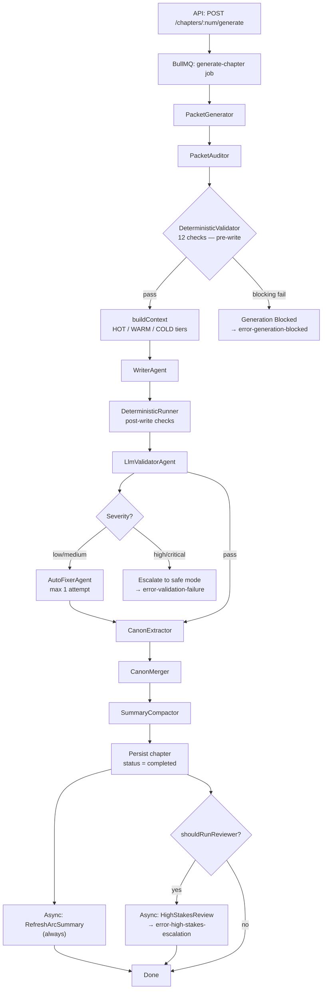
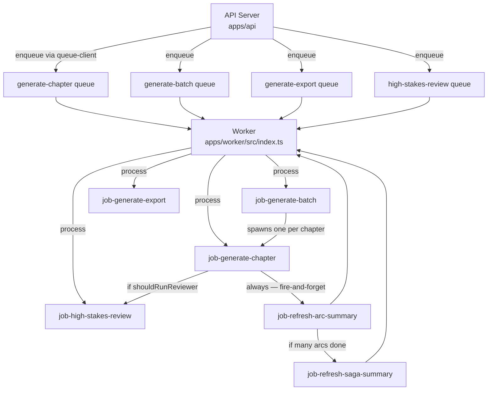
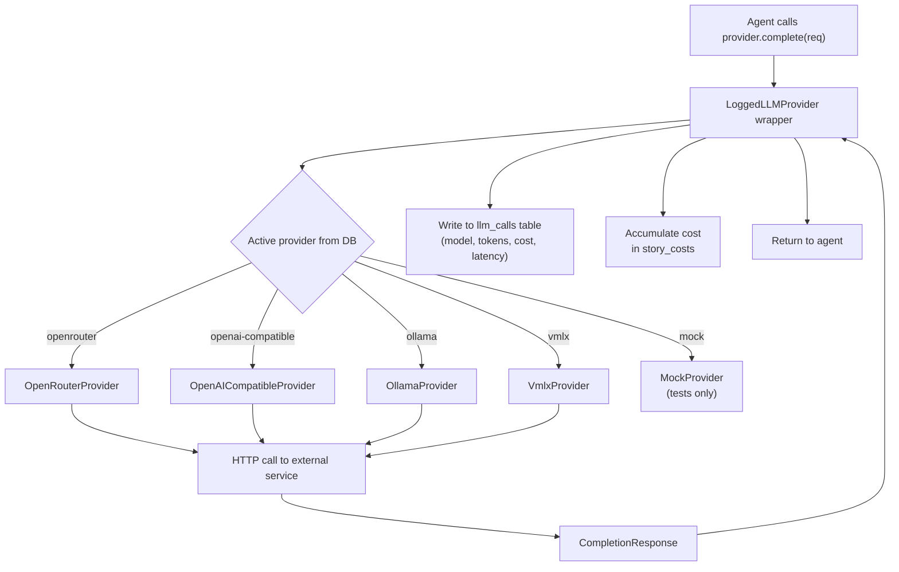
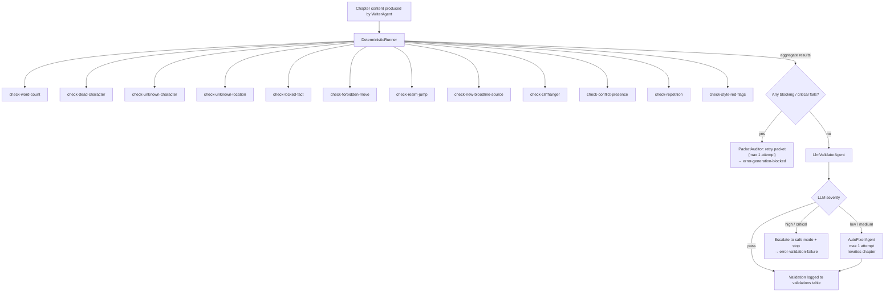

# Novel graph — flows

## chapter-generation-flow

`flows/chapter-generation-flow.md`

---
type: flow
---

Flow: Chapter Generation Overview
**Type:** System Flow
The main chapter production pipeline, orchestrated by [[jobs/job-generate-chapter]]. Transforms a chapter number + arc context into completed chapter prose stored in the database. Runs as a BullMQ background job (concurrency 1). Triggered by an API call or spawned by [[jobs/job-generate-batch]].

Flow: Chapter Generation Diagram

Flow: Chapter Generation Pipeline Stages
| # | Stage | Actor | DB Written |
|---|-------|-------|------------|
| 1 | Packet generation | [[agents/packet-generator]] | [[database/tables/chapter-packets]] |
| 2 | Canon audit (pre-write) | [[validators/packet-auditor]] | — (may retry packet gen once) |
| 3 | Deterministic pre-check | [[validators/deterministic-runner]] | [[database/tables/validations]] |
| 4 | Context assembly | [[modules/context-builder]] | [[database/tables/context-packets]] |
| 5 | Write prose | [[agents/writer]] | [[database/tables/chapters]] (draft) |
| 6 | Deterministic post-check | [[validators/deterministic-runner]] | [[database/tables/validations]] |
| 7 | LLM validation | [[agents/llm-validator]] | [[database/tables/validations]] |
| 8 | Auto-fix (conditional) | [[agents/auto-fixer]] | [[database/tables/chapters]] (revised) |
| 9 | Canon extraction | [[agents/canon-extractor]] | — |
| 10 | Canon merge | [[modules/canon-merger]] | [[database/tables/characters]], [[database/tables/canon-facts]], [[database/tables/open-threads]], [[database/tables/timeline-events]], [[database/tables/planted-seeds]], [[database/tables/pending-canon-updates]] |
| 11 | Summary compact | [[agents/summary-compactor]] | [[database/tables/chapter-summaries]] |
| 12 | Finalize chapter | job completes | [[database/tables/chapters]] (status = completed) |
| 13 | Async: arc summary refresh | [[jobs/job-refresh-arc-summary]] | [[database/tables/arcs]] |
| 14 | Async: high-stakes review (conditional) | [[jobs/job-high-stakes-review]] | [[database/tables/high-stakes-reviews]] |

Flow: Chapter Generation Participants
- [[jobs/job-generate-chapter]] — orchestrator
- [[agents/packet-generator]], [[validators/packet-auditor]] — plan stage
- [[validators/deterministic-runner]] — deterministic checks (pre and post write)
- [[modules/context-builder]] — 3-tier context assembly
- [[agents/writer]] — prose generation
- [[agents/llm-validator]], [[agents/auto-fixer]] — LLM validation + fix
- [[agents/canon-extractor]], [[modules/canon-merger]] — memory stage
- [[agents/summary-compactor]] — summary + embedding
- [[jobs/job-refresh-arc-summary]], [[jobs/job-high-stakes-review]] — async follow-ups

Flow: Chapter Generation Triggers
- API call: `POST /api/stories/:storyId/chapters/:num/generate` → [[routes/chapters]]
- Batch coordinator: [[jobs/job-generate-batch]] spawns one `generate-chapter` job per chapter

Flow: Chapter Generation Outputs / Side Effects
- [[database/tables/chapters]] — title, content, status, wordCount, deterministicValidation
- [[database/tables/chapter-packets]] — generated planning packet
- [[database/tables/context-packets]] — context snapshot + tier hashes (observability)
- [[database/tables/validations]] — all validation results
- [[database/tables/chapter-summaries]] — compacted summary + 1536-dim embedding
- [[database/tables/characters]], [[database/tables/canon-facts]], [[database/tables/open-threads]], [[database/tables/planted-seeds]], [[database/tables/timeline-events]] — updated via canon merger
- [[database/tables/pending-canon-updates]] — conflicting updates staged for human review
- [[database/tables/llm-calls]] — every LLM call logged with tokens + cost

Flow: Chapter Generation Error Paths
- Deterministic blocking → [[errors/error-generation-blocked]]
- LLM validation high/critical → [[errors/error-validation-failure]]
- Budget cap breached → [[errors/error-budget-exceeded]]
- Canon conflict detected → [[errors/error-canon-conflict]]
- High-stakes trigger (async) → [[errors/error-high-stakes-escalation]]

Flow: Chapter Generation Generation Modes
| Mode | Batch Size | Human Approval Needed |
|------|------------|-----------------------|
| `safe` | 1 chapter | Required before each chapter |
| `semi_auto` | 5 chapters | On escalation only |
| `full_auto` | 30 chapters | On escalation only |
Auto-escalation to `safe` is triggered when: first/last chapter of an arc, high/critical validator finding, or blocking canon conflict.

Flow: Chapter Generation Related Flows
- [[flows/validation-flow]]
- [[flows/llm-provider-flow]]
- [[flows/job-worker-flow]]

---

## job-worker-flow

`flows/job-worker-flow.md`

---
type: flow
---

Flow: Job / Worker Overview
**Type:** System Flow
How background work is enqueued by the API and processed by the BullMQ worker. The API is the sole producer; the worker is the sole consumer. Jobs are durable (Redis-backed) and survive process restarts. The LLM provider configuration is snapshotted into the job payload at enqueue time, ensuring the worker uses the exact provider active when the job was requested.

Flow: Job / Worker Diagram

Flow: Job / Worker Queues
| Queue | Producer | Consumer | Concurrency |
|-------|---------|---------|-------------|
| `generate-chapter` | [[modules/queue-client]] / [[jobs/job-generate-batch]] | [[jobs/job-generate-chapter]] | 1 |
| `generate-batch` | [[modules/queue-client]] | [[jobs/job-generate-batch]] | 1 |
| `generate-export` | [[modules/queue-client]] | [[jobs/job-generate-export]] | 2 |
| `high-stakes-review` | [[modules/queue-client]] / [[jobs/job-generate-chapter]] | [[jobs/job-high-stakes-review]] | 1 |
| `refresh-arc-summary` | [[jobs/job-generate-chapter]] | [[jobs/job-refresh-arc-summary]] | 1 |
| `refresh-saga-summary` | [[jobs/job-refresh-arc-summary]] | [[jobs/job-refresh-saga-summary]] | 1 |

Flow: Job / Worker Job Lifecycle
1. API handler validates request + checks budget via [[modules/budget-guard]]
2. API reads active LLM provider from [[database/tables/llm-provider-state]] → snapshots `providerName` + `modelRoutes` into job payload
3. Job enqueued to Redis via [[modules/queue-client]] (BullMQ `Queue.add()`)
4. [[workers/worker-main]] picks up job from the appropriate queue
5. Job handler runs its full pipeline
6. On success: chapter status → `completed`; follow-up jobs enqueued (fire-and-forget)
7. On failure: chapter status → `failed`; error stored in BullMQ job result
8. Stale job detector (polls every 5 min) resets any chapter stuck in `generating` status back to `failed`

Flow: Job / Worker Participants
- [[apps/app-api]] — sole job producer
- [[apps/app-worker]] — sole job consumer
- [[workers/worker-main]] — bootstraps all 6 BullMQ Worker instances + stale detector
- [[workers/queues]] — TypeScript Queue instances + job type declarations
- [[modules/queue-client]] — API-side enqueue wrappers
- [[external-services/service-redis]] — Redis backing store
- [[external-services/service-bullmq]] — BullMQ queue framework

Flow: Job / Worker Triggers
- `POST /api/stories/:storyId/chapters/:num/generate` → enqueues `generate-chapter`
- `POST /api/stories/:storyId/batches` → enqueues `generate-batch`
- `POST /api/stories/:storyId/export` → enqueues `generate-export`
- `POST /api/stories/:storyId/chapters/:num/review` → enqueues `high-stakes-review`

Flow: Job / Worker Outputs / Side Effects
- Job status tracked in Redis (BullMQ-managed: waiting → active → completed/failed)
- Chapter status transitions: `pending` → `generating` → `completed` / `failed`
- All DB writes happen inside individual job handlers (see each job note)
- Stale job detector resets chapters stuck > lock duration in `generating` → `failed`

Flow: Job / Worker Error Paths
- Job throws unhandled error → BullMQ marks job `failed`; worker logs error
- Stale detection: chapter stuck in `generating` with no active BullMQ job → reset to `failed`
- Budget exceeded before enqueue → HTTP error returned to API caller; job never enqueued

Flow: Job / Worker Related Flows
- [[flows/chapter-generation-flow]]
- [[flows/llm-provider-flow]]

---

## llm-provider-flow

`flows/llm-provider-flow.md`

---
type: flow
---

Flow: LLM Provider Overview
**Type:** System Flow
How every LLM completion request is routed from an agent through the provider abstraction layer, logged, and costed. The active provider is snapshotted at job-enqueue time; the worker instantiates the correct provider class and wraps it in `LoggedLLMProvider` before passing it to any agent.

Flow: LLM Provider Diagram

Flow: LLM Provider Provider Selection
1. **At job-enqueue time** (API): reads `llm_provider_settings` + `llm_provider_state` from DB → snapshots `providerName` + `modelRoutes` into the BullMQ job payload
2. **At job execution** (Worker): instantiates the correct provider class from `providerName` in the job data
3. Provider is wrapped by `LoggedLLMProvider` before being passed to any agent — no agent ever touches an unwrapped provider
| Provider Name | External Service | Auth Env Var | Retry |
|--------------|-----------------|--------------|-------|
| `openrouter` | [[external-services/service-openrouter]] | `OPENROUTER_API_KEY` | 6 attempts, exp. backoff |
| `openai-compatible` | [[external-services/service-openai-compatible]] | `OPENAI_COMPATIBLE_API_KEY` | None (single attempt) |
| `ollama` | [[external-services/service-ollama]] | None (local) | None |
| `vmlx` | [[external-services/service-vmlx]] | None (local) | None |
| `mock` | N/A | None | N/A — tests only |

Flow: LLM Provider Model Routing
- `modelFor(role: AgentRole)` from `@novel/core` reads `MODEL_CONFIG.routes` to map agent role → model string
- Active DB settings override defaults at runtime via `PUT /api/admin/models` (→ [[routes/admin]])
- Per-story overrides via `story_settings`, loaded with `getEffectiveConfig(storyId, provider)` — always used inside worker jobs
- **Never hardcode model strings** — using a literal model name outside `MODEL_CONFIG` is a bug

Flow: LLM Provider Cost Calculation
- `estimateCostUsd(model, usage)` from `MODEL_CONFIG.pricing` (per-token pricing table)
- Per-chapter hard cap: **$0.05** | Daily: **$5.00** | Monthly: **$50.00**
- Budget checked pre-enqueue ([[modules/budget-guard]]) and during generation (`checkAgainstCaps()`)
- See [[errors/error-budget-exceeded]]

Flow: LLM Provider Participants
- All AI agents: [[agents/writer]], [[agents/llm-validator]], [[agents/auto-fixer]], [[agents/canon-extractor]], [[agents/summary-compactor]], [[agents/packet-generator]], [[agents/arc-planner]], [[agents/saga-planner]], [[agents/high-stakes-reviewer]], [[agents/bible-generator]], [[agents/arc-summary-compactor]]
- [[ai-providers/provider-interface]] — shared contract
- [[ai-providers/provider-openrouter]], [[ai-providers/provider-openai-compatible]], [[ai-providers/provider-ollama]], [[ai-providers/provider-vmlx]], [[ai-providers/provider-mock]]
- [[modules/llm-call-logger]] — inside `LoggedLLMProvider`
- [[modules/cost-tracker]] — `accumulateStoryCost()`

Flow: LLM Provider Triggers
- Any agent calls `provider.complete(req)` during pipeline execution

Flow: LLM Provider Outputs / Side Effects
- [[database/tables/llm-calls]] — every call: model, prompt tokens, completion tokens, cost (USD), latency (ms), optionally full prompt text (`LOG_LLM_PROMPTS` env var)
- Rolling cost accumulator updated in `story_costs` (via [[modules/cost-tracker]])
- Budget guardrails enforced on each call

Flow: LLM Provider Error Paths
- Budget cap breached → [[errors/error-budget-exceeded]]
- Provider HTTP error (non-retryable) → exception thrown to agent; job marked `failed`
- Rate limit (`openrouter` only) → exponential backoff, up to 6 retries before failing

Flow: LLM Provider Related Flows
- [[flows/chapter-generation-flow]]
- [[flows/job-worker-flow]]

---

## validation-flow

`flows/validation-flow.md`

---
type: flow
---

Flow: Validation Overview
**Type:** System Flow
Two-stage validation pipeline that checks generated chapter content for canon integrity and narrative quality. Stage 1 is deterministic (no LLM, fast, 12 checks). Stage 2 uses an LLM. [[agents/auto-fixer]] handles low/medium issues automatically; high/critical findings halt generation and escalate to safe mode.

Flow: Validation Diagram

Flow: Validation Stage 1 — Deterministic (12 Checks)
All checks run in one pass; sorted critical-first; short-circuits on first `critical` failure.
| Check | Severity | Condition |
|-------|----------|-----------|
| [[validators/check-word-count]] | high | Content too short |
| [[validators/check-dead-character]] | critical | Dead char referenced alive |
| [[validators/check-realm-jump]] | critical | Cultivation realm skipped (cultivation/martial only) |
| [[validators/check-locked-fact]] | high | Locked canon fact contradicted |
| [[validators/check-forbidden-move]] | high | Forbidden plot move used |
| [[validators/check-unknown-character]] | medium | Unknown character referenced |
| [[validators/check-unknown-location]] | medium | Unknown location referenced |
| [[validators/check-new-bloodline-source]] | medium | New bloodline introduced (cultivation only) |
| [[validators/check-cliffhanger]] | low | Chapter ends without hook |
| [[validators/check-conflict-presence]] | low | No meaningful conflict in chapter |
| [[validators/check-style-red-flags]] | medium | Style rule violations from bible |
| [[validators/check-repetition]] | low | Excessive repetition detected |
Runner: [[validators/deterministic-runner]] — `buildChecks()` + `runDeterministicValidator()`

Flow: Validation Stage 2 — LLM Validation
[[agents/llm-validator]] evaluates style consistency, narrative voice, and logic coherence.
Output: `{ pass, issues: [{code, severity, message}], summary }`
Temperature: 0.1

Flow: Validation Stage 3 — Auto-Fix (Conditional)
[[agents/auto-fixer]] runs when max severity ≤ `medium`.
- Max 1 attempt (`AUTO_FIX_MAX_ATTEMPTS = 1`)
- Rewrites chapter content addressing all listed issues
- On success: generation continues to canon extraction
- `high`/`critical`: auto-fixer does NOT run; generation escalates

Flow: Validation Participants
- [[validators/deterministic-runner]]
- [[validators/check-word-count]], [[validators/check-dead-character]], [[validators/check-unknown-character]], [[validators/check-unknown-location]], [[validators/check-locked-fact]], [[validators/check-forbidden-move]], [[validators/check-realm-jump]], [[validators/check-new-bloodline-source]], [[validators/check-cliffhanger]], [[validators/check-conflict-presence]], [[validators/check-repetition]], [[validators/check-style-red-flags]]
- [[agents/llm-validator]]
- [[agents/auto-fixer]]
- [[validators/packet-auditor]] (pre-write blocking check)

Flow: Validation Triggers
- Called after [[agents/writer]] produces chapter content (post-write)
- [[validators/packet-auditor]] also runs deterministic checks pre-write on the planning packet
- Both are part of [[flows/chapter-generation-flow]]

Flow: Validation Outputs / Side Effects
- [[database/tables/validations]] — all `CheckResult` records persisted (both deterministic + LLM)
- [[database/tables/chapters]] — `deterministicValidation` JSON field updated; content may be replaced by auto-fixer

Flow: Validation Error Paths
- Critical deterministic failure → [[errors/error-generation-blocked]]
- LLM high/critical finding → [[errors/error-validation-failure]]

Flow: Validation Related Flows
- [[flows/chapter-generation-flow]]
- [[flows/llm-provider-flow]]

---
